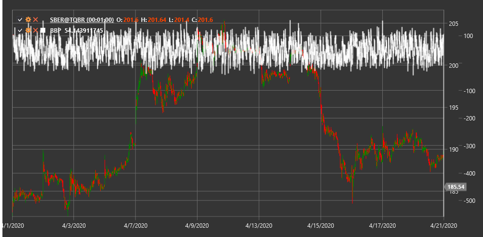

# BBP

**Bollinger Percent B (BBP)** is an indicator developed by John Bollinger as a complement to the Bollinger Bands indicator. BBP shows the price location relative to the upper and lower Bollinger Bands.

To use the indicator, you need to use the [BollingerPercentB](xref:StockSharp.Algo.Indicators.BollingerPercentB) class.

## Description

The Bollinger Percent B indicator determines the price position relative to the upper and lower Bollinger Bands as a percentage value from 0 to 1 (or from 0% to 100%). This allows for a more precise determination of the price position in the context of Bollinger Bands:

- A value of 1 (or 100%) means the price is at the upper Bollinger Band.
- A value of 0 (or 0%) means the price is at the lower Bollinger Band.
- A value of 0.5 (or 50%) means the price is at the middle Bollinger Band (SMA).

BBP can also take values outside the 0-1 range:
- Values above 1 indicate that the price is above the upper Bollinger Band.
- Values below 0 indicate that the price is below the lower Bollinger Band.

## Parameters

The indicator has the following parameters:
- **Length** - SMA calculation period (default value: 20)
- **StdDevMultiplier** - standard deviation multiplier for calculating Bollinger Bands (default value: 2)

## Calculation

The Bollinger Percent B calculation is based on the formula:

```
BBP = (Price - Lower Bollinger Band) / (Upper Bollinger Band - Lower Bollinger Band)
```

Where:
- Price - current price (usually closing price)
- Lower Bollinger Band = SMA - (StdDevMultiplier * Standard Deviation)
- Upper Bollinger Band = SMA + (StdDevMultiplier * Standard Deviation)
- SMA - simple moving average over the Length period
- Standard Deviation - price standard deviation over the Length period

## Usage

Bollinger Percent B can be used in various ways:

1. **Identifying Overbought/Oversold Conditions**:
   - Values above 1 indicate an overbought market
   - Values below 0 indicate an oversold market

2. **Reversal Signals**:
   - When BBP returns to the 0-1 range after going outside it
   - Divergences between BBP and price

3. **Trend Determination**:
   - BBP values consistently above 0.5 indicate an upward trend
   - BBP values consistently below 0.5 indicate a downward trend

4. **Finding Hidden Support and Resistance Levels**:
   - Levels 0.8 and 0.2 are often used as additional support and resistance levels



## See Also

[BollingerBands](bollinger_bands.md)
[StdDev](standard_deviation.md)
[RSI](rsi.md)