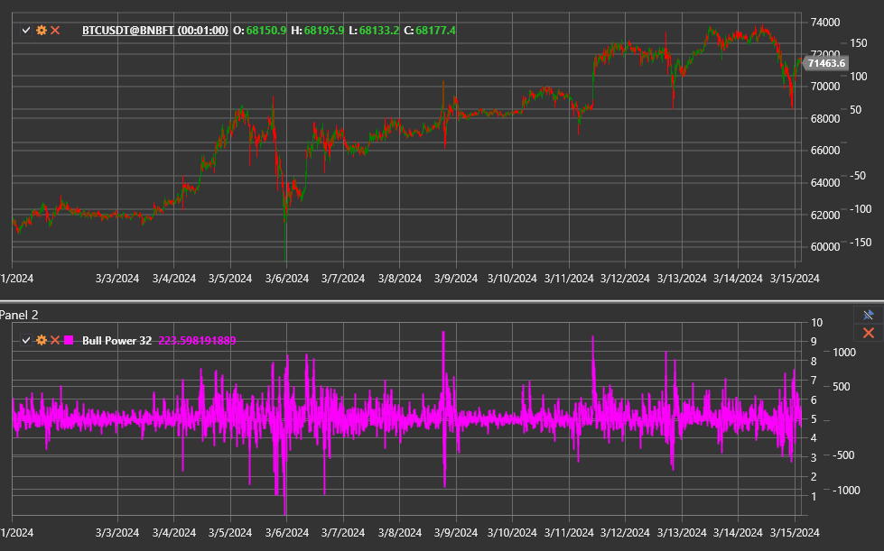

# Bull Power

**Bull Power** is the bullish counterpart within the Elder-ray system. It measures how strongly buyers push prices above an
exponential moving average (EMA) by comparing the bar high with the average price.

Use the [BullPower](xref:StockSharp.Algo.Indicators.BullPower) class to work with this indicator.

## Description

The indicator uses the formula:

`Bull Power = High − EMA`.

- Positive values confirm bullish pressure and support a rising trend.
- Falling values toward zero or below zero signal weakening bulls.
- Extreme peaks may precede corrections, especially when the EMA is pointing downward.

## Parameters

Bull Power inherits its parameters from [ExponentialMovingAverage](xref:StockSharp.Algo.Indicators.ExponentialMovingAverage):

- **Length** — EMA period.
- **Alpha** (optional) — smoothing coefficient, when applicable.

## Usage

- Rising Bull Power together with a rising EMA confirms trend strength.
- Price making new highs without higher Bull Power readings forms bearish divergence.
- Combine Bull and Bear Power with the price EMA to evaluate the full [Elder Ray](elder_ray.md) structure.

## See also

[Bear Power](bear_power.md)
[Elder Ray](elder_ray.md)
[ExponentialMovingAverage](ema.md)
