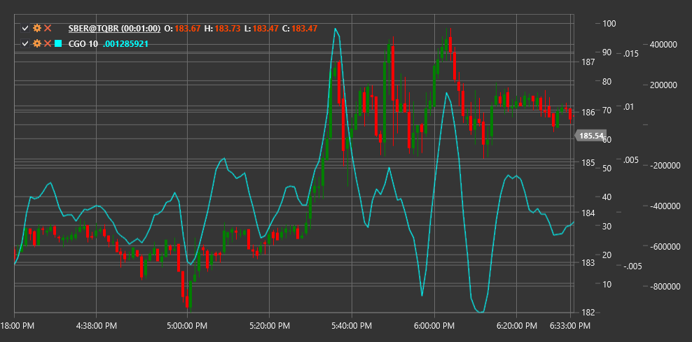

# CGO

**Center of Gravity Oscillator (CGO)** is a technical indicator developed by John Ehlers, based on the concept of center of gravity in physics and applied to analyzing price movement in the market.

To use the indicator, you need to use the [CenterOfGravityOscillator](xref:StockSharp.Algo.Indicators.CenterOfGravityOscillator) class.

## Description

The Center of Gravity Oscillator (CGO) is a leading indicator that attempts to identify market reversal points by treating the price series as a physical system and determining its "center of gravity". The indicator calculates where the "equilibrium" is in current price movements and uses this information to forecast future trend direction changes.

CGO is particularly useful for:
- Identifying potential reversal points before they appear on the price chart
- Revealing the strength and weakness of the current trend
- Detecting hidden divergences between price and the indicator
- Creating trading systems based on leading signals

## Parameters

The indicator has the following parameters:
- **Length** - calculation period (default value: 10)

## Calculation

The Center of Gravity Oscillator (CGO) calculation is based on the formula:

```
CGO = - Sum(Price(i) * (i + 1)) / Sum(Price(i))
```

Where:
- i - price value index in the period from 0 to (Length-1)
- Price(i) - price (usually closing price) for the corresponding index i
- Sum - sum of all values in the Length period

In this formula, each price is weighted by its position in the time series and then normalized by the total sum of prices. The minus sign before the formula is added to make the indicator rise when the price rises, making it more intuitive.

## Interpretation

- **Zero Line Crossing**: When CGO crosses the zero line from bottom to top, this can be viewed as a bullish signal. Crossing from top to bottom may indicate a bearish signal.

- **Indicator Extremes**: When CGO reaches extremes (maximums or minimums), this can indicate a potential trend reversal.

- **Divergences**: 
  - Bullish Divergence: when the price forms a new low, but CGO does not confirm it, forming a higher low.
  - Bearish Divergence: when the price reaches a new high, but CGO forms a lower high.

- **Indicator Movement**: Rapid CGO movement in one direction can indicate the beginning of a new trend. If the indicator moves slowly or oscillates around the zero line, this may indicate market consolidation.

Since CGO is a leading indicator, its signals often appear before corresponding changes on the price chart, giving traders an advantage in making trading decisions.



## See Also

[SineWave](sine_wave.md)
[HarmonicOscillator](harmonic_oscillator.md)
[FisherTransform](ehlers_fisher_transform.md)
[RVI](rvi.md)