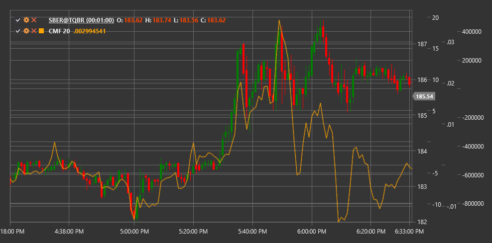

# CMF

**Chaikin Money Flow (CMF)** is a technical indicator developed by Mark Chaikin that measures the strength of money flow (accumulation and distribution) in the market over a specific period.

To use the indicator, you need to use the [ChaikinMoneyFlow](xref:StockSharp.Algo.Indicators.ChaikinMoneyFlow) class.

## Description

Chaikin Money Flow (CMF) expands on the concept of the Accumulation/Distribution Line (A/D Line), focusing on a specific time period. The indicator measures money flow volume expressed as a percentage of total volume over the specified period.

CMF helps traders:
- Determine the strength of buying and selling pressure
- Identify accumulation (buying) and distribution (selling) trends
- Detect divergences between price movement and money flow
- Confirm the current trend or its weakness

The key idea of CMF is that in a strong upward trend, the closing price should be closer to the period's high, while in a strong downward trend, it should be closer to the period's low.

## Parameters

The indicator has the following parameters:
- **Length** - calculation period (standard value: 20-21 days)

## Calculation

CMF calculation involves the following steps:

1. Calculate Money Flow Multiplier for each period:
   ```
   Money Flow Multiplier = ((Close - Low) - (High - Close)) / (High - Low)
   ```
   
   If (High - Low) = 0, then Money Flow Multiplier = 0.

2. Calculate Money Flow Volume for the period:
   ```
   Money Flow Volume = Money Flow Multiplier * Volume
   ```

3. Calculate Chaikin Money Flow:
   ```
   CMF = Sum(Money Flow Volume over Length period) / Sum(Volume over Length period)
   ```

## Interpretation

CMF oscillates around the zero line and is typically within the range of -1 to +1:

- **Positive CMF values** (above zero):
  - Indicate buyer pressure (accumulation)
  - The higher the value, the stronger the buyer pressure
  - Particularly significant if sustained for a prolonged period

- **Negative CMF values** (below zero):
  - Indicate seller pressure (distribution)
  - The lower the value, the stronger the seller pressure
  - Prolonged stay in the negative zone confirms a downward trend

- **Zero Line Crossing**:
  - Crossing from bottom to top may indicate the start of an upward trend
  - Crossing from top to bottom may signal the beginning of a downward trend

- **Divergences**:
  - Bullish Divergence: price declines while CMF rises (potential upward reversal)
  - Bearish Divergence: price rises while CMF falls (potential downward reversal)

- **Extreme Levels**:
  - Values above +0.25 may indicate strong accumulation
  - Values below -0.25 may indicate strong distribution



## See Also

[ADL](accumulation_distribution_line.md)
[OBV](obv.md)
[ForceIndex](force_index.md)
[MFI](money_flow_index.md)