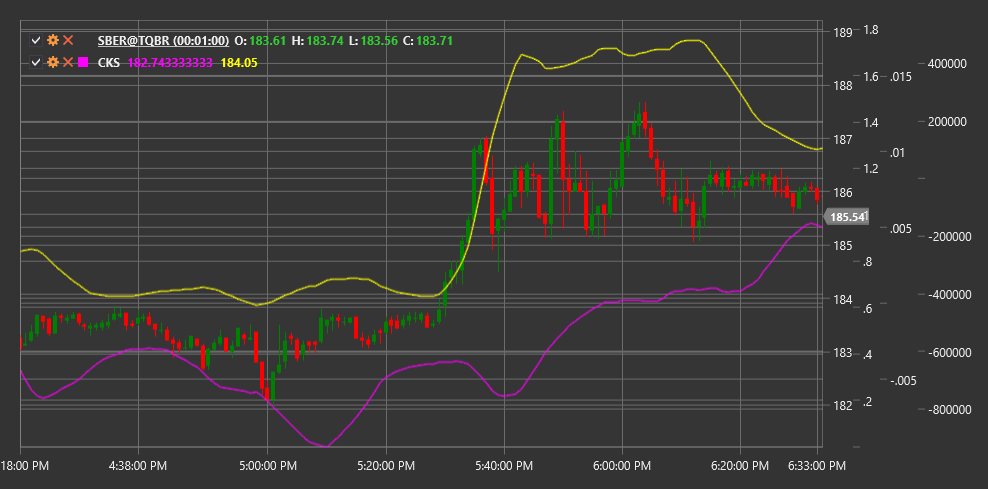

# CKS

**Chande Kroll Stop (CKS)** is an indicator for determining stop-loss levels, developed by Tushar Chande and Stanley Kroll, which adapts to market volatility and helps traders set position exit points.

To use the indicator, you need to use the [ChandeKrollStop](xref:StockSharp.Algo.Indicators.ChandeKrollStop) class.

## Description

The Chande Kroll Stop indicator was developed as a dynamic tool for setting stop-loss levels that responds to changes in market volatility and trend. It consists of two lines: an upper stop line (for short positions) and a lower stop line (for long positions).

The main advantage of CKS lies in its ability to adapt to current market conditions. During periods of high volatility, stop lines are positioned further from the price, helping to avoid premature position closure due to market noise. During periods of low volatility, stop lines move closer to the price, providing tighter trend following.

CKS is particularly useful for:
- Determining stop-loss levels for long and short positions
- Following the trend with adaptive risk control
- Identifying potential trend reversal points
- Creating mechanical trading systems with clear exit rules

## Parameters

The indicator has the following parameters:
- **Period** - main period for calculating extremums (default value: 10)
- **Multiplier** - multiplier for ATR, determining the distance from extremums (default value: 1.5)
- **StopPeriod** - period for calculating stop levels (default value: 20)

## Calculation

Chande Kroll Stop calculation involves the following steps:

1. Determining high and low extremums over the Period:
   ```
   HighestHigh = Highest High value over Period
   LowestLow = Lowest Low value over Period
   ```

2. Calculating Average True Range (ATR) over Period:
   ```
   ATR = Average TR value over Period
   ```

3. Calculating upper and lower bands:
   ```
   Upper Band = HighestHigh - (Multiplier * ATR)
   Lower Band = LowestLow + (Multiplier * ATR)
   ```

4. Determining final stop lines based on StopPeriod:
   ```
   Upper Stop = Highest value of upper band over StopPeriod
   Lower Stop = Lowest value of lower band over StopPeriod
   ```

## Interpretation

- **Upper Stop** is used for short positions. If the closing price exceeds the upper stop, this can be considered a signal to close a short position or open a long position.

- **Lower Stop** is used for long positions. If the closing price falls below the lower stop, this can be considered a signal to close a long position or open a short position.

- **Price crossing stop lines** may indicate a potential trend reversal or the beginning of a new momentum.

- **Abrupt changes in stop lines** can occur with significant market volatility changes.

- **Use with other indicators**: CKS works best in combination with other trend and momentum indicators that help determine market entry direction.



## See Also

[ATR](atr.md)
[ParabolicSAR](parabolic_sar.md)
[SuperTrend](supertrend.md)
[DonchianChannels](donchian_channels.md)