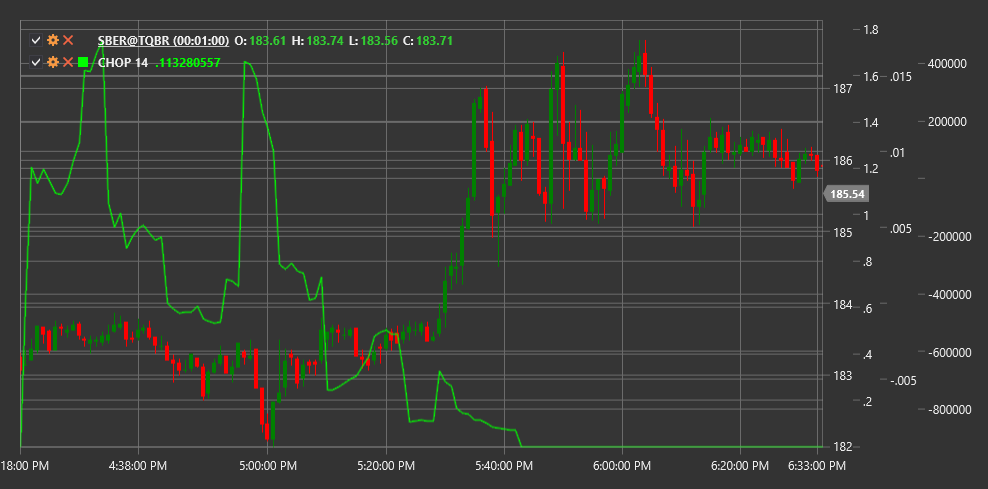

# CHOP

**Choppiness Index (CHOP)** is an indicator designed to determine whether the market is in a sideways movement (within a range) or in a trending state.

To use the indicator, you need to use the [ChoppinessIndex](xref:StockSharp.Algo.Indicators.ChoppinessIndex) class.

## Description

The Choppiness Index (CHOP) was created to quantitatively assess volatility and determine the nature of market movement. Unlike many other indicators, CHOP is not meant to identify trend direction or generate buy or sell signals. Instead, it helps traders determine whether the market is in consolidation (sideways movement) or in a directional trend.

The CHOP indicator oscillates between 0 and 100:
- Values closer to 100 indicate strong consolidation (high "choppiness")
- Values closer to 0 indicate a strong directional trend (low "choppiness")

CHOP is particularly useful for:
- Determining an appropriate trading strategy based on market character
- Identifying transitions from sideways movement to trend and vice versa
- Confirming or refuting signals from other indicators
- Avoiding false signals during consolidation

## Parameters

The indicator has the following parameters:
- **Length** - calculation period (default value: 14)

## Calculation

Choppiness Index calculation involves the following steps:

1. Calculate the sum of True Ranges over the selected period:
   ```
   Sum of TR = Sum(TR(i)) for i from 1 to Length
   ```

2. Calculate the highest High and lowest Low over the selected period:
   ```
   Highest High = maximum High value over Length period
   Lowest Low = minimum Low value over Length period
   ```

3. Calculate the CHOP index:
   ```
   CHOP = 100 * LOG10(Sum TR / (Highest High - Lowest Low)) / LOG10(Length)
   ```

Where:
- TR - true range for each candle
- Length - selected period
- LOG10 - decimal logarithm

## Interpretation

- **High CHOP values (above 60-70)** indicate that the market is in a sideways movement (consolidation). During this period, it's better to avoid trend strategies and consider range trading strategies.

- **Low CHOP values (below 30-40)** indicate a strong directional trend. This is a good time to use trend strategies and follow price movement.

- **Transitions between high and low values** can indicate a change in market character. A CHOP drop from high values may signal the beginning of a new trend. A CHOP rise from low values may warn of trend exhaustion and transition to consolidation.

- **Setting threshold levels**: Typically, the following threshold levels are used:
  - Above 60-70: High "choppiness" (sideways movement)
  - 30-60: Moderate "choppiness" (transitional state)
  - Below 30: Low "choppiness" (strong trend)



## See Also

[ATR](atr.md)
[ADX](adx.md)
[VHF](vhf.md)
[TrueRange](true_range.md)