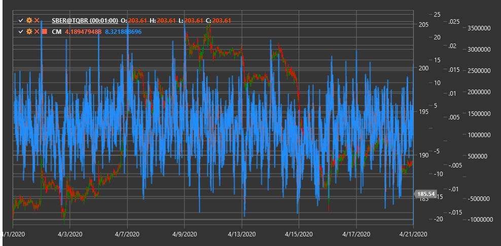

# CM

**Composite Momentum (CM)** is an indicator that combines multiple methods of measuring price momentum to obtain more reliable signals about trend strength and direction.

To use the indicator, you need to use the [CompositeMomentum](xref:StockSharp.Algo.Indicators.CompositeMomentum) class.

## Description

The Composite Momentum (CM) indicator is a comprehensive tool that integrates various aspects of price movement, including price change rate, relative strength, and other momentum components. Through this combined approach, CM provides a more complete picture of current market momentum compared to traditional one-dimensional momentum indicators.

CM is effective for:
- Determining the strength of the current trend
- Identifying potential reversal points
- Detecting divergences between price and momentum
- Filtering out false signals from other indicators

Composite Momentum is particularly useful in volatile markets where traditional momentum indicators may generate numerous false signals.

## Calculation

Composite Momentum calculation involves several stages and components:

1. Calculating momentum components:
   - Price change relative to previous periods
   - Ratio between recent highs and lows
   - Volume analysis accompanying price movement

2. Normalizing each component to bring them to comparable scales.

3. Weighted summation of components to obtain the final CM value.

The final CM value is an oscillator that can fluctuate in both positive and negative areas:
- Positive values indicate upward momentum
- Negative values indicate downward momentum
- The magnitude of the value (absolute value) indicates momentum strength

## Interpretation

- **Zero Line Crossing**:
  - Transition from negative to positive zone can be viewed as a bullish signal
  - Transition from positive to negative zone can be viewed as a bearish signal

- **Extreme Values**:
  - Very high positive values may indicate market overbought conditions
  - Very low negative values may indicate market oversold conditions

- **Divergences**:
  - Bullish Divergence: price forms a new low, while CM forms a higher low
  - Bearish Divergence: price forms a new high, while CM forms a lower high

- **Trend Confirmation**:
  - Consistently positive CM values confirm the strength of an upward trend
  - Consistently negative CM values confirm the strength of a downward trend

- **Momentum Loss**:
  - Decrease in the absolute value of CM in the trend direction may signal momentum loss and a potential reversal

## See Also

[Momentum](momentum.md)
[ROC](roc.md)
[RSI](rsi.md)
[MACD](macd.md)