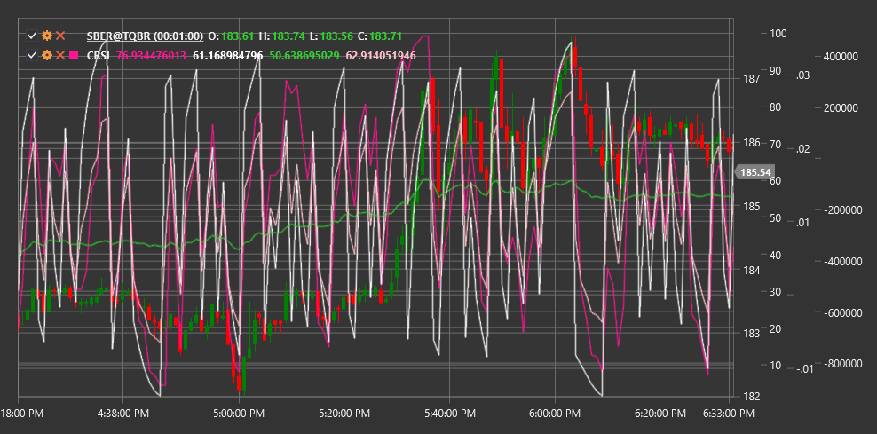

# CRSI

**Connors RSI (CRSI)** is a comprehensive technical indicator developed by Larry Connors that combines three components to measure market overbought and oversold conditions.

To use the indicator, you need to use the [ConnorsRSI](xref:StockSharp.Algo.Indicators.ConnorsRSI) class.

## Description

Connors RSI is an advanced version of the traditional Relative Strength Index (RSI), which adds two additional components to provide more accurate overbought and oversold signals.

Unlike standard RSI, which only considers price change, Connors RSI also takes into account the streak (series of consecutive price movements in one direction) and rate of change (ROC), making it more sensitive to short-term changes and more reliable in identifying extreme market conditions.

CRSI is particularly useful for:
- Identifying short-term entry and exit opportunities
- Determining extreme overbought and oversold levels
- Creating trading systems based on mean reversion
- Filtering signals from other indicators

## Parameters

The indicator has the following parameters:
- **RSIPeriod** - period for calculating the RSI component (default value: 3)
- **StreakRSIPeriod** - period for calculating the streak RSI component (default value: 2)
- **ROCRSIPeriod** - period for calculating the rate of change RSI component (default value: 100)

## Calculation

Connors RSI calculation involves three components that are then averaged to obtain the final value:

1. **Price RSI Component** - standard RSI calculated over a short period (usually 3 days):
   ```
   RSI = 100 - (100 / (1 + RS))
   where RS = Average Positive Change / Average Negative Change
   ```

2. **Streak RSI Component**:
   - First, calculate the streak (number of consecutive days of price rise or fall)
   - Then apply RSI to this streak using the StreakRSIPeriod

3. **Rate of Change RSI Component (ROC RSI)**:
   - Calculate the Percentile Rank of the current ROC over the ROCRSIPeriod
   - Scale the Percentile Rank from 0 to 100

4. **Final Connors RSI Value**:
   ```
   CRSI = (RSI + StreakRSI + ROCRSI) / 3
   ```

## Interpretation

Connors RSI oscillates between 0 and 100, similar to standard RSI:

- **Extremely high values (above 90)** indicate strong overbought conditions. This may be a signal to sell or take a short position.

- **Extremely low values (below 10)** indicate strong oversold conditions. This may be a signal to buy or close a short position.

- **Standard Levels**:
  - Above 70-80: overbought
  - Below 20-30: oversold
  - 40-60: neutral zone

- **Divergences**:
  - Bullish Divergence: price forms a new low, while CRSI forms a higher low
  - Bearish Divergence: price forms a new high, while CRSI forms a lower high

Connors RSI works best on charts with timeframes from daily to weekly and in mean reversion-oriented trading strategies.



## See Also

[RSI](rsi.md)
[RMI](relative_momentum_index.md)
[LRSI](laguerre_rsi.md)