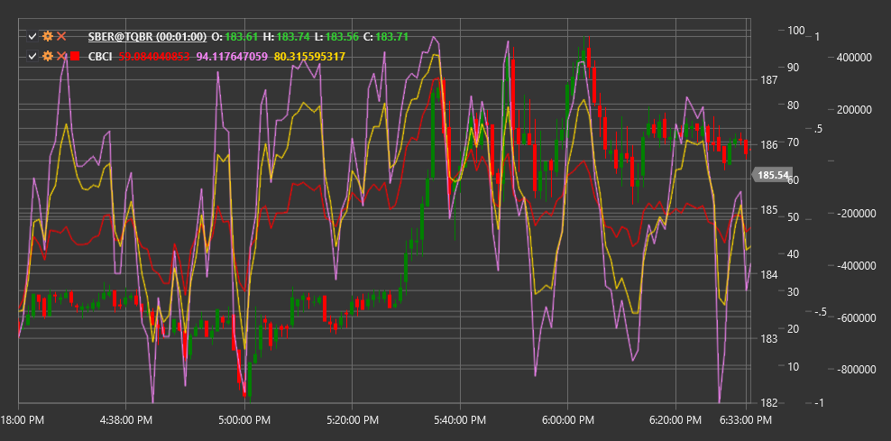

# CBCI

**Constance Brown Composite Index (CBCI)** is an indicator developed by Constance Brown that combines elements from various technical indicators to create a comprehensive market analysis tool.

To use the indicator, you need to use the [ConstanceBrownCompositeIndex](xref:StockSharp.Algo.Indicators.ConstanceBrownCompositeIndex) class.

## Description

The Constance Brown Composite Index (CBCI) was created to merge the strengths of several indicators into one comprehensive tool. It incorporates elements of the stochastic oscillator, RSI, and other oscillators to provide more accurate signals about potential market reversals and trend movements.

CBCI is designed for:
- Identifying potential trend reversal points
- Determining overbought and oversold levels
- Detecting hidden divergences
- Confirming the strength of the current trend

The indicator works well across various timeframes and market types, including stocks, forex, and commodity markets.

## Parameters

The indicator has the following parameters:
- **Length** - main calculation period for the index (default value: 14)
- **StochasticKPeriod** - period for calculating the stochastic oscillator %K (default value: 5)
- **StochasticDPeriod** - period for calculating the stochastic oscillator %D (default value: 3)

## Calculation

CBCI calculation involves the following steps:

1. Calculate RSI over the Length period:
   ```
   RSI = 100 - (100 / (1 + RS))
   RS = Average Gain / Average Loss
   ```

2. Calculate the stochastic oscillator:
   ```
   %K = ((Close - Lowest Low) / (Highest High - Lowest Low)) * 100
   %D = SMA(%K, StochasticDPeriod)
   ```

3. Combine RSI and stochastic oscillator:
   ```
   CBCI = (RSI + %K + %D) / 3
   ```

This combined index can then be smoothed to reduce noise.

## Interpretation

- **Overbought and Oversold Levels**: 
  - Values above 80 may indicate market overbought conditions
  - Values below 20 may indicate market oversold conditions

- **Centerline Crossovers**:
  - Crossing from below to above the 50 line can be viewed as a bullish signal
  - Crossing from above to below the 50 line can be viewed as a bearish signal

- **Divergences**:
  - Classic divergences: when price and CBCI move in opposite directions
  - Hidden divergences: when price and CBCI create different types of highs or lows

- **Trend Movement**:
  - If CBCI consistently remains above 50, it may indicate uptrend strength
  - If CBCI consistently remains below 50, it may indicate downtrend strength



## See Also

[RSI](rsi.md)
[StochasticOscillator](stochastic_oscillator.md)
[StochasticK](stochastic_oscillator_k.md)
[CCI](cci.md)