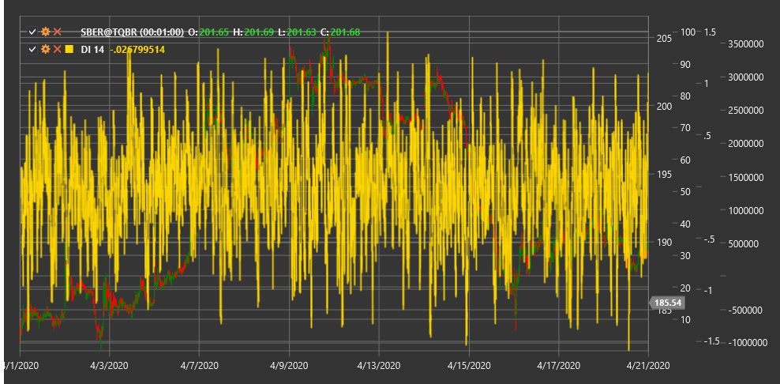

# DI

**Demand Index (DI)** is a technical indicator developed by James Sibbett that analyzes the relationship between price and volume to assess demand strength and buyer pressure in the market.

To use the indicator, you need to use the [DemandIndex](xref:StockSharp.Algo.Indicators.DemandIndex) class.

## Description

The Demand Index (DI) is a comprehensive volume indicator that evaluates the relationship between price and volume to determine how strong buyer pressure (demand) is compared to seller pressure. The indicator is based on the assumption that the ratio of price change to volume change allows for a more accurate assessment of market demand than simply observing price or volume individually.

DI aims to identify the following market situations:
- Strong demand (buyer pressure)
- Weak demand (seller pressure)
- Imbalance between price and volume (potential reversal points)
- Confirmation or refutation of the current trend

## Parameters

The indicator has the following parameters:
- **Length** - calculation period (default value: 13)

## Calculation

The Demand Index calculation is quite complex and involves several stages:

1. Calculating the price component based on price change:
   ```
   Price Component = ((High + Low + Close) / 3) - ((Previous High + Previous Low + Previous Close) / 3)
   ```

2. Calculating the volume component, taking into account relative volume change.

3. Computing demand as the ratio of price and volume components:
   ```
   Raw Demand = Price Component / Volume Component
   ```

4. Smoothing the obtained values to reduce noise:
   ```
   Smoothed Demand = EMA(Raw Demand, Length)
   ```

5. Normalizing the result to obtain the final index:
   ```
   Demand Index = 100 * Normalized(Smoothed Demand)
   ```

## Interpretation

The Demand Index can be interpreted in various ways:

1. **Extreme Levels**:
   - High positive values indicate strong demand (buyer pressure)
   - High negative values indicate weak demand (seller pressure)

2. **Zero Line Crossovers**:
   - Crossing from bottom to top can be viewed as a bullish signal
   - Crossing from top to bottom can be viewed as a bearish signal

3. **Divergences**:
   - Bullish Divergence: price forms a new low, but DI forms a higher low
   - Bearish Divergence: price forms a new high, but DI forms a lower high

4. **DI Trends**:
   - Sustained positive DI values confirm an upward trend
   - Sustained negative DI values confirm a downward trend

5. **Extreme Values**:
   - Very high or very low values may indicate market overbought or oversold conditions

Using the Demand Index is most effective when combined with other indicators and analysis methods to filter out false signals.



## See Also

[OBV](obv.md)
[ADL](accumulation_distribution_line.md)
[ChaikinMoneyFlow](chaikin_money_flow.md)
[BalanceOfPower](balance_of_power.md)