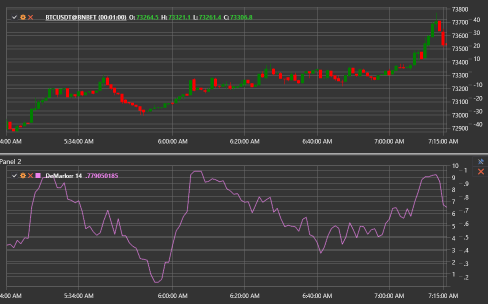

# DeMarker

The **DeMarker (DeM)** indicator evaluates buying and selling pressure by comparing the extrema of the current bar with the previous
one. It highlights overbought and oversold zones and helps spot potential turning points.

Use the [DeMarker](xref:StockSharp.Algo.Indicators.DeMarker) class to work with this indicator.

## Calculation

1. For each bar compute intermediate values:  
   `DeMax = max(High − PreviousHigh, 0)`  
   `DeMin = max(PreviousLow − Low, 0)`
2. Smooth `DeMax` and `DeMin` with a moving average of length **Length**.
3. Calculate the final value:  
   `DeMarker = SMA(DeMax, Length) / (SMA(DeMax, Length) + SMA(DeMin, Length))`.

The output is normalised between 0 and 1.

## Parameters

- **Length** — smoothing period controlling the responsiveness of the indicator.

## Interpretation

- **Above 0.7** — overbought conditions, potential downward correction.
- **Below 0.3** — oversold conditions, potential upward reversal.
- **Divergence** between price and the indicator warns about a trend change.

DeMarker can be used for counter-trend entries as well as confirming signals from momentum oscillators.

## See also

[RSI](rsi.md)
[Stochastic Oscillator](stochastic_oscillator.md)
[Momentum](momentum.md)
