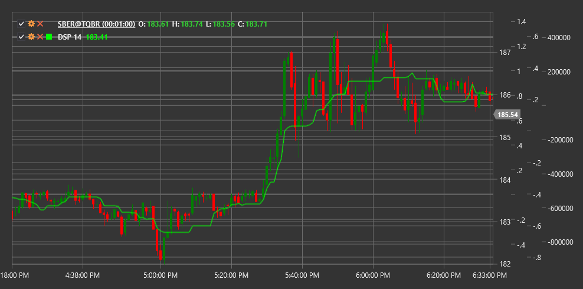

# DSP

**Detrended Synthetic Price (DSP)** is a technical indicator that removes the overall trend from a price series, allowing traders to focus on short-term price fluctuations.

To use the indicator, you need to use the [DetrendedSyntheticPrice](xref:StockSharp.Algo.Indicators.DetrendedSyntheticPrice) class.

## Description

The DSP indicator was developed to eliminate the long-term trend from a price chart, enabling traders to more clearly see short-term cycles and oscillations. It is particularly useful for identifying short-term trading opportunities that may be hidden by the dominant trend.

The main idea of DSP is that by removing the trend from the price series, it becomes easier to identify the cyclical components of price movement. This makes the indicator especially valuable for traders specializing in short-term trading and using cyclical patterns.

DSP is useful for:
- Identifying short-term market cycles
- Determining potential reversal points
- Detecting divergences with price
- Creating trading systems based on the cyclical nature of markets

## Parameters

The indicator has the following parameters:
- **Length** - calculation period (default value: 10-20 periods)

## Calculation

Calculating the Detrended Synthetic Price involves the following steps:

1. Calculate the moving average of price over the specified period:
   ```
   MA = SMA(Price, Length)
   ```

2. Determine the offset for synthetic price calculation:
   ```
   Offset = (Length / 2) + 1
   ```

3. Calculate synthetic price by subtracting the shifted moving average from the current price:
   ```
   DSP = Price - MA[shifted (Length/2) + 1 periods back]
   ```

Where:
- Price - current price (usually closing price)
- MA - simple moving average
- Length - selected calculation period

## Interpretation

The DSP indicator oscillates around the zero line and can be interpreted as follows:

1. **Zero Line Crossovers**:
   - When DSP crosses the zero line from bottom to top, it can be viewed as a bullish signal
   - When DSP crosses the zero line from top to bottom, it can be viewed as a bearish signal

2. **Indicator Extremes**:
   - When DSP reaches extremely high values, it may indicate market overbought conditions
   - When DSP reaches extremely low values, it may indicate market oversold conditions

3. **Cyclical Analysis**:
   - Regular DSP oscillations can be used to determine market cycle periodicity
   - Changes in oscillation amplitude may indicate shifts in market dynamics

4. **Divergences**:
   - Bullish Divergence: price forms a new low, while DSP forms a higher low
   - Bearish Divergence: price forms a new high, while DSP forms a lower high

5. **Pattern Formation**:
   - Technical patterns (head and shoulders, double bottom, etc.) can form on the DSP chart, potentially providing additional trading signals



## See Also

[DetrendedPriceOscillator](dpo.md)
[CenterOfGravityOscillator](center_of_gravity_oscillator.md)
[SineWave](sine_wave.md)