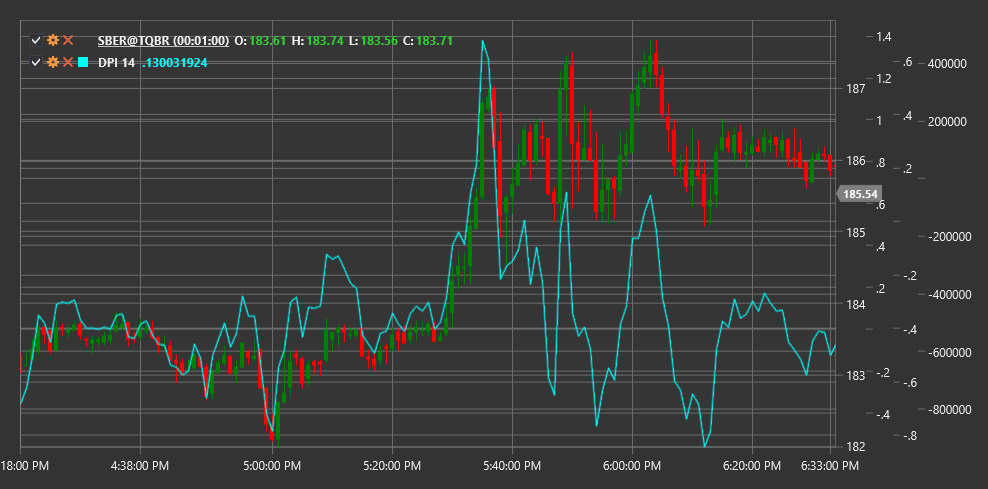

# DPI

**Disparity Index (DPI)** is a technical indicator that measures the relative deviation of the current price from a moving average over a specified period, expressed as a percentage.

To use the indicator, you need to use the [DisparityIndex](xref:StockSharp.Algo.Indicators.DisparityIndex) class.

## Description

The Disparity Index (DPI) is designed to measure the degree of price deviation from its moving average. This indicator helps determine how far the price is "stretched" relative to its average value and can be used to identify potential overbought or oversold conditions.

DPI is based on the assumption that price tends to return to its mean value after a significant deviation. The larger the deviation, the higher the probability of subsequent price movement in the opposite direction, bringing it closer to the average.

The Disparity Index is useful for:
- Identifying extreme price deviations from its mean
- Detecting potential reversal points
- Measuring the strength of the current trend
- Creating trading strategies based on mean reversion

## Parameters

The indicator has the following parameters:
- **Length** - period for calculating the moving average (default value: 14)

## Calculation

The Disparity Index calculation formula is quite simple:

```
DPI = ((Price / MA) - 1) * 100
```

Where:
- Price - current price (usually closing price)
- MA - moving average of price over the Length period
- Result is expressed as a percentage

Positive DPI values indicate that the price is above its moving average, while negative values indicate that the price is below its moving average.

## Interpretation

The Disparity Index can be interpreted as follows:

1. **Extreme Levels**:
   - High positive values (e.g., above +10%) may indicate market overbought conditions
   - High negative values (e.g., below -10%) may indicate market oversold conditions

2. **Zero Line Crossovers**:
   - Crossing from bottom to top (from negative to positive values) indicates that the price has crossed its moving average from bottom to top, which can be viewed as a bullish signal
   - Crossing from top to bottom (from positive to negative values) indicates that the price has crossed its moving average from top to bottom, which can be viewed as a bearish signal

3. **Divergences**:
   - Bullish Divergence: price reaches a new low, but DPI forms a higher low
   - Bearish Divergence: price reaches a new high, but DPI forms a lower high

4. **Trend Analysis**:
   - Consistently positive DPI values indicate a strong upward trend
   - Consistently negative DPI values indicate a strong downward trend
   - Oscillations around zero may indicate a sideways trend or consolidation

5. **Mean Reversion Strategies**:
   - Extreme DPI values can be used to open positions against the current price movement, expecting a return to the mean



## See Also

[SMA](sma.md)
[RSI](rsi.md)
[StochasticOscillator](stochastic_oscillator.md)
[BollingerBands](bollinger_bands.md)