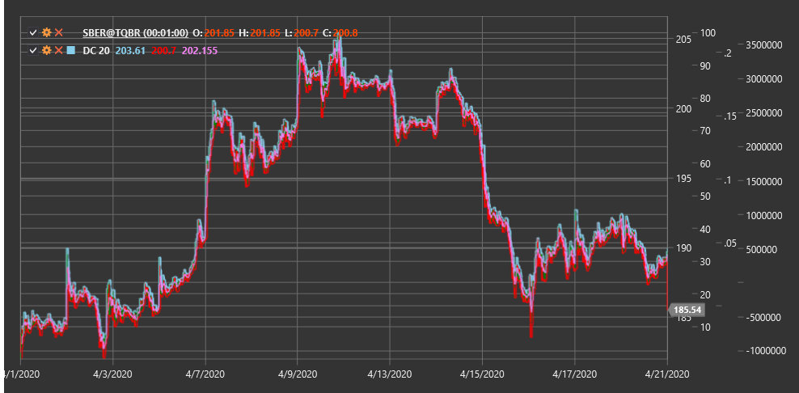

# DC

**Donchian Channels (DC)** is a technical indicator developed by trader Richard Donchian, consisting of an upper and lower band (channel boundaries) based on the maximum and minimum price values over a specific period.

To use the indicator, you need to use the [DonchianChannels](xref:StockSharp.Algo.Indicators.DonchianChannels) class.

## Description

Donchian Channels are a simple yet effective volatility and trend indicator. The indicator consists of three lines:
- Upper line: highest high over the selected period
- Lower line: lowest low over the selected period
- Middle line: average value between the upper and lower lines

This indicator was first used by Richard Donchian in his 4-week channel rule, according to which a buy signal occurs when the price exceeds the highest high of 4 weeks, and a sell signal occurs when the price falls below the lowest low of 4 weeks.

Donchian Channels are useful for:
- Identifying market volatility
- Determining support and resistance levels
- Generating breakout signals
- Defining the current trading range

## Parameters

The indicator has the following parameters:
- **Length** - calculation period (default value: 20)

## Calculation

Donchian Channels calculation is quite simple:

1. Upper channel line:
   ```
   Upper = Highest High over Length period
   ```

2. Lower channel line:
   ```
   Lower = Lowest Low over Length period
   ```

3. Middle channel line:
   ```
   Middle = (Upper + Lower) / 2
   ```

## Interpretation

Donchian Channels can be used in various ways:

1. **Breakout Strategies**:
   - Breaking above the upper channel line can be viewed as a buy signal
   - Breaking below the lower channel line can be viewed as a sell signal

2. **Trend Determination**:
   - If the price is in the upper half of the channel (above the middle line), an upward trend can be inferred
   - If the price is in the lower half of the channel (below the middle line), a downward trend can be inferred

3. **Support and Resistance Levels**:
   - The upper channel line can serve as a resistance level
   - The lower channel line can serve as a support level

4. **Volatility Measurement**:
   - Channel width (difference between upper and lower lines) indicates market volatility
   - Channel expansion indicates increased volatility
   - Channel contraction indicates decreased volatility

5. **Counter-Trend Strategies**:
   - Some traders use opposite signals, expecting the price to return to the middle line after reaching the channel edges



## See Also

[BollingerBands](bollinger_bands.md)
[KeltnerChannels](keltner_channels.md)
[Highest](highest.md)
[Lowest](lowest.md)