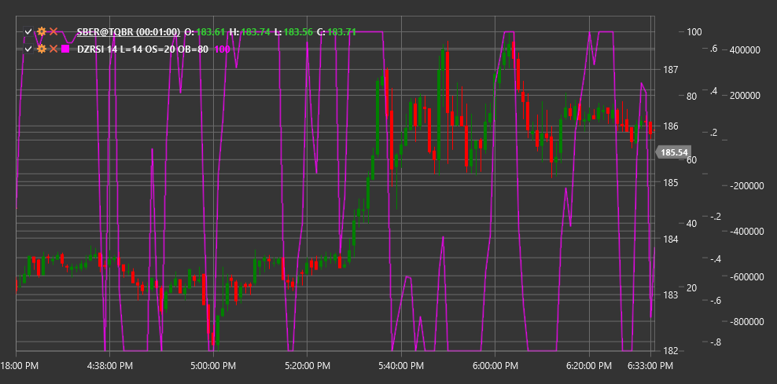

# DZRSI

**Dynamic Zones RSI (DZRSI)** is a modification of the classic Relative Strength Index (RSI) that uses dynamically changing overbought and oversold levels instead of static ones.

To use the indicator, you need to use the [DynamicZonesRSI](xref:StockSharp.Algo.Indicators.DynamicZonesRSI) class.

## Description

The Dynamic Zones RSI (DZRSI) is based on the traditional RSI, but with an important improvement: instead of using fixed overbought and oversold levels (usually 70 and 30), DZRSI adapts these levels to current market conditions.

The main idea of DZRSI is that different market conditions require different thresholds for determining overbought and oversold states. In a strong upward trend, RSI can remain above the traditional overbought level of 70 for an extended period without providing accurate entry or exit signals. Similarly, in a strong downward trend, RSI can stay below the oversold level of 30 for a long time.

DZRSI solves this problem by dynamically adjusting these levels based on the historical behavior of the RSI itself, making the indicator more adaptive to various market regimes.

## Parameters

The indicator has the following parameters:
- **Length** - period for calculating the base RSI (default value: 14)
- **OverboughtLevel** - initial overbought level (default value: 70)
- **OversoldLevel** - initial oversold level (default value: 30)

## Calculation

DZRSI calculation involves several steps:

1. Calculate standard RSI over the specified Length period:
   ```
   RSI = 100 - (100 / (1 + RS))
   RS = Average Positive Change / Average Negative Change
   ```

2. Determine the RSI oscillation range over a specific historical period.

3. Adapt overbought and oversold levels based on this range:
   ```
   Dynamic Overbought Level = Base Overbought Level + Adjustment Based on Historical Data
   Dynamic Oversold Level = Base Oversold Level - Adjustment Based on Historical Data
   ```

4. Adjust dynamic zones based on the strength of the current trend.

## Interpretation

DZRSI is interpreted similarly to traditional RSI, but with consideration of dynamic zones:

1. **Overbought and Oversold Signals**:
   - When DZRSI rises above the current dynamic overbought level, it may indicate market overbought conditions
   - When DZRSI falls below the current dynamic oversold level, it may indicate market oversold conditions

2. **Reversal Signals**:
   - Reversal from the dynamic overbought level downward can be viewed as a sell signal
   - Reversal from the dynamic oversold level upward can be viewed as a buy signal

3. **Divergences**:
   - Bullish Divergence: price forms a new low, while DZRSI forms a higher low
   - Bearish Divergence: price forms a new high, while DZRSI forms a lower high

4. **Trend Analysis**:
   - In an upward trend, the dynamic oversold level may be higher than the traditional 30
   - In a downward trend, the dynamic overbought level may be lower than the traditional 70

5. **Centerline (50) Crossovers**:
   - Crossing from bottom to top can be viewed as a bullish signal
   - Crossing from top to bottom can be viewed as a bearish signal



## See Also

[RSI](rsi.md)
[ConnorsRSI](connors_rsi.md)
[StochasticRSI](stochastic_rsi.md)
[LRSI](laguerre_rsi.md)