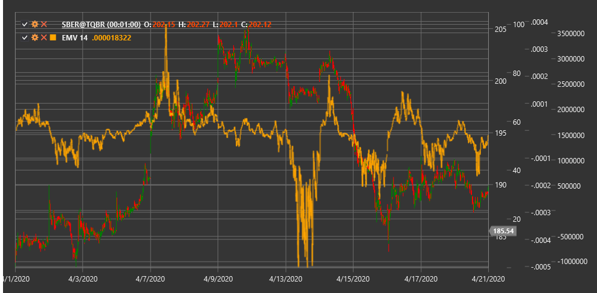

# EMV

**Ease of Movement (EMV)** is a technical indicator developed by Richard Arms that correlates price change with volume to assess the ease with which price moves up or down.

To use the indicator, you need to use the [EaseOfMovement](xref:StockSharp.Algo.Indicators.EaseOfMovement) class.

## Description

The Ease of Movement (EMV) indicator was created to measure the relationship between price movement and volume. The main concept of the indicator is that in an upward trend, price should move up easily with little volume, while in a downward trend, price should move down easily also with little volume.

EMV combines information about price range, price change, and volume to create a measure of price movement "ease". Positive EMV values indicate that price is rising with relative ease, while negative values indicate that price is falling with relative ease.

The indicator is particularly useful for:
- Confirming the strength or weakness of the current trend
- Identifying potential reversal points
- Detecting divergences with price
- Evaluating the "quality" of price movement considering volume

## Parameters

The indicator has the following parameters:
- **Length** - smoothing period (default value: 14)

## Calculation

Ease of Movement indicator calculation involves the following steps:

1. Calculate Midpoint Move:
   ```
   Midpoint = (High + Low) / 2
   Midpoint Move = Midpoint[current] - Midpoint[previous]
   ```

2. Calculate Box Ratio (volume-distance coefficient):
   ```
   Box Ratio = Volume / (High - Low)
   ```

3. Calculate single-period EMV:
   ```
   1-Period EMV = Midpoint Move / Box Ratio
   ```

4. Smooth to obtain final EMV:
   ```
   EMV = SMA(1-Period EMV, Length)
   ```

Where:
- High - candle's highest price
- Low - candle's lowest price
- Volume - trading volume
- SMA - simple moving average

## Interpretation

The EMV indicator can be interpreted as follows:

1. **Zero Line Crossovers**:
   - Crossing from bottom to top (from negative to positive values) can be viewed as a bullish signal, indicating that price is beginning to move up with ease
   - Crossing from top to bottom (from positive to negative values) can be viewed as a bearish signal, indicating that price is beginning to move down with ease

2. **Extreme Values**:
   - High positive values indicate that price is moving up very easily (with little volume)
   - High negative values indicate that price is moving down very easily (with little volume)

3. **Divergences**:
   - Bullish Divergence: price forms a new low, while EMV forms a higher low (may indicate a potential upward reversal)
   - Bearish Divergence: price forms a new high, while EMV forms a lower high (may indicate a potential downward reversal)

4. **EMV Trends**:
   - Sustained positive values confirm an upward trend
   - Sustained negative values confirm a downward trend
   - Oscillations around zero may indicate a sideways trend or consolidation

5. **Volume Analysis**:
   - If price rises with a positive EMV, this confirms the strength of the upward movement
   - If price falls with a negative EMV, this confirms the strength of the downward movement
   - If price rises with a negative EMV or falls with a positive EMV, this may indicate the instability of the current movement



## See Also

[ForceIndex](force_index.md)
[BalanceOfPower](balance_of_power.md)
[ADL](accumulation_distribution_line.md)
[OBV](obv.md)