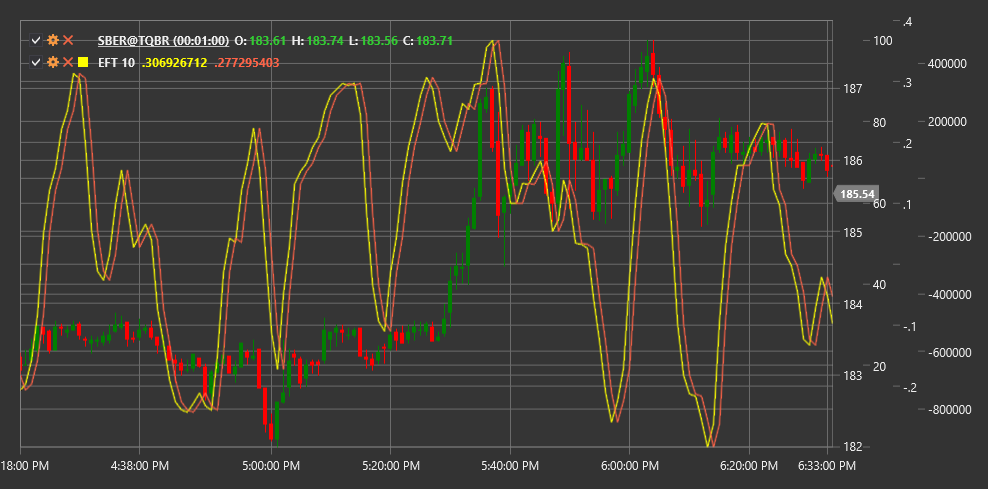

# EFT

**Ehlers Fisher Transform (EFT)** is a technical indicator developed by John Ehlers that uses the Fisher statistical transformation to convert price data into a normally distributed form.

To use the indicator, you need to use the [EhlersFisherTransform](xref:StockSharp.Algo.Indicators.EhlersFisherTransform) class.

## Description

The Ehlers Fisher Transform is based on the concept that market prices do not have a normal (Gaussian) distribution. Instead, they often demonstrate asymmetrical distributions. The indicator applies a mathematical Fisher transformation formula to convert these asymmetrical distributions into normally distributed values.

This transformation makes extreme price movements more noticeable and helps more clearly identify market reversal points. When the Fisher transformation is applied, peak values increase sharply, making market behavior extremes more obvious.

EFT is particularly useful for:
- Determining potential market reversal points
- Identifying overbought and oversold conditions
- Detecting hidden divergences between price and the indicator
- Generating more accurate entry and exit signals

## Parameters

The indicator has the following parameters:
- **Length** - calculation period (default value: 10)

## Calculation

Ehlers Fisher Transform calculation involves several steps:

1. Transform price data to values between -1 and +1 (typically using normalized price rank or another oscillator):
   ```
   Value = (2 * ((Price - Min) / (Max - Min))) - 1
   ```
   where Min and Max are the minimum and maximum prices over the Length period.

2. Apply the Fisher transformation:
   ```
   If Value >= 0.999, then Value = 0.999
   If Value <= -0.999, then Value = -0.999
   
   Fisher = 0.5 * ln((1 + Value) / (1 - Value))
   ```
   where ln is the natural logarithm.

3. Smooth to reduce noise:
   ```
   EFT = EMA(Fisher, Period)
   ```
   where EMA is the exponential moving average.

## Interpretation

The Ehlers Fisher Transform can be interpreted as follows:

1. **Extreme Values**:
   - Values above +2 often indicate market overbought conditions
   - Values below -2 often indicate market oversold conditions

2. **Zero Line Crossovers**:
   - Crossing the zero line from bottom to top can be viewed as a bullish signal
   - Crossing the zero line from top to bottom can be viewed as a bearish signal

3. **Indicator Reversal**:
   - Indicator reversal from extreme values often precedes price reversal

4. **Divergences**:
   - Bullish Divergence: price forms a new low, while EFT forms a higher low
   - Bearish Divergence: price forms a new high, while EFT forms a lower high

5. **Indicator Line Slope**:
   - Steep upward slope indicates strong upward momentum
   - Steep downward slope indicates strong downward momentum

The Ehlers Fisher Transform differs from many other oscillators in that it can reach extreme values and remain there for some time without necessarily reversing immediately. This makes it useful for identifying strong trend movements.



## See Also

[CenterOfGravityOscillator](center_of_gravity_oscillator.md)
[SineWave](sine_wave.md)
[HarmonicOscillator](harmonic_oscillator.md)
[RSI](rsi.md)