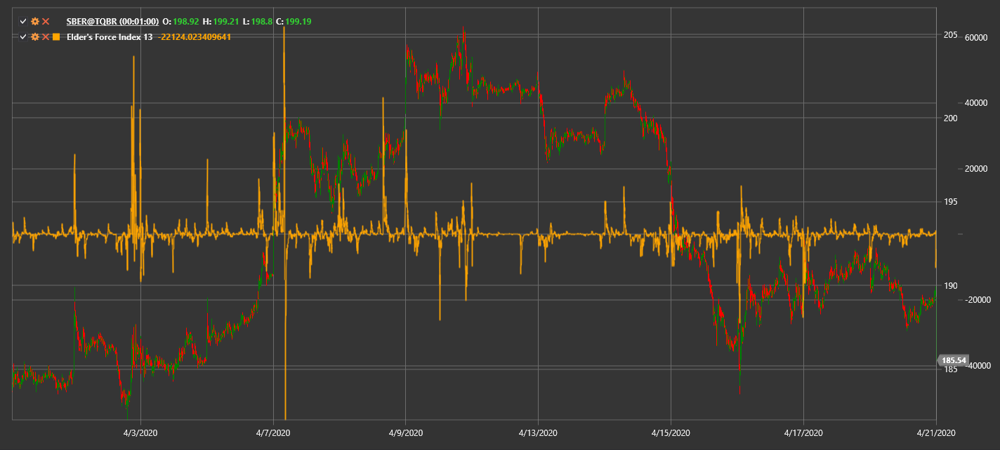

# Elder's Force Index

**Elder's Force Index (EFI)** measures buying and selling pressure using price change and volume.

To use the indicator, you must use the [ElderForceIndex](xref:StockSharp.Algo.Indicators.ElderForceIndex) class.

## Recommended content

[Force Index](force_index.md)
