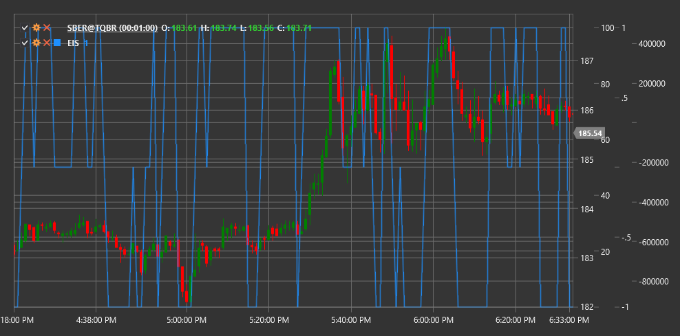

# EIS

**Elder Impulse System (EIS)** is a technical indicator developed by Dr. Alexander Elder that combines a trend indicator and a momentum oscillator to determine the direction and strength of market movement.

To use the indicator, you need to use the [ElderImpulseSystem](xref:StockSharp.Algo.Indicators.ElderImpulseSystem) class.

## Description

The Elder Impulse System (EIS) is a simple yet powerful tool for visualizing market momentum. It combines two indicators:
1. **Exponential Moving Average (EMA)** - to determine trend direction
2. **MACD Histogram** - to measure price movement strength and momentum

EIS classifies each candle on the price chart into one of three categories (usually denoted by different colors):
- **Green (strong bullish impulse)** - when both indicators are rising
- **Red (strong bearish impulse)** - when both indicators are falling
- **Blue or neutral (no clear impulse)** - when indicators move in opposite directions

EIS is particularly useful for:
- Quickly visually determining trend direction and strength
- Identifying entry and exit points in the direction of the main trend
- Identifying potential reversal points
- Filtering out false signals

## Calculation

Elder Impulse System calculation involves the following steps:

1. Calculate 13-period exponential moving average (EMA):
   ```
   EMA = EMA(Close, 13)
   ```

2. Calculate MACD Histogram (standard values: 12, 26, 9):
   ```
   MACD Line = EMA(Close, 12) - EMA(Close, 26)
   Signal Line = EMA(MACD Line, 9)
   MACD Histogram = MACD Line - Signal Line
   ```

3. Determine color classification for the current candle:
   ```
   If EMA[current] > EMA[previous] AND MACD Histogram[current] > MACD Histogram[previous], then Green (Bullish Impulse)
   If EMA[current] < EMA[previous] AND MACD Histogram[current] < MACD Histogram[previous], then Red (Bearish Impulse)
   Otherwise Blue (No Impulse)
   ```

## Interpretation

The Elder Impulse System is interpreted as follows:

1. **Green Candles (strong bullish impulse)**:
   - Indicate a strong upward momentum
   - Best time to buy or hold long positions
   - A series of green candles indicates a strong upward trend

2. **Red Candles (strong bearish impulse)**:
   - Indicate a strong downward momentum
   - Best time to sell or hold short positions
   - A series of red candles indicates a strong downward trend

3. **Blue Candles (no clear impulse)**:
   - Indicate uncertainty or consolidation
   - Signal a possible slowdown or trend reversal
   - Often appear during consolidation periods or before a trend change

4. **Trading Strategies**:
   - Buy when candles change color from blue to green
   - Sell when candles change color from blue to red
   - Close long positions when candles change color from green to any other
   - Close short positions when candles change color from red to any other

5. **Trend Confirmation**:
   - A sequence of green candles confirms an upward trend
   - A sequence of red candles confirms a downward trend
   - Color alternation indicates a sideways trend or uncertainty



## See Also

[EMA](ema.md)
[MACD](macd.md)
[MACDHistogram](macd_histogram.md)
[ForceIndex](force_index.md)