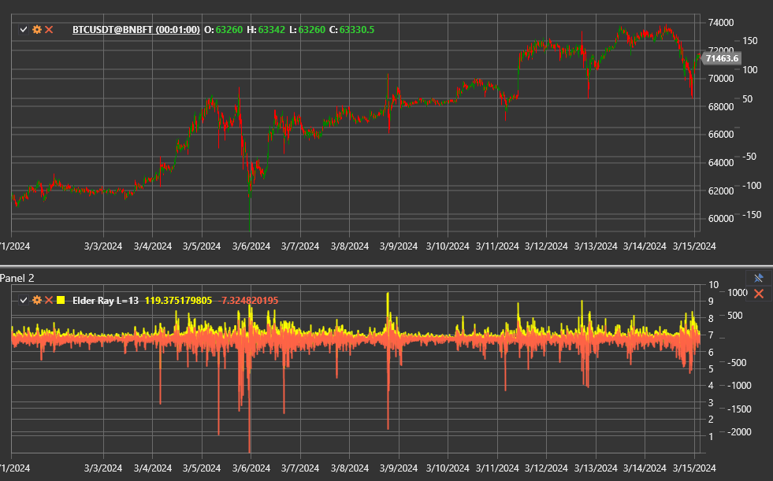

# Elder Ray

The **Elder Ray Index** is a composite indicator by Alexander Elder that combines an exponential moving average with the Bull Power
and Bear Power oscillators. It visualises the balance between buyers and sellers and helps identify when one side loses control.

Use the [ElderRay](xref:StockSharp.Algo.Indicators.ElderRay) class to access the indicator.

## Components

The indicator returns a [ElderRayValue](xref:StockSharp.Algo.Indicators.ElderRayValue) structure containing:

- **EMA** — the baseline exponential moving average of closing prices;
- **Bull Power** — the distance between the bar high and the EMA;
- **Bear Power** — the distance between the bar low and the EMA.

## Parameters

Elder Ray inherits the settings of [ExponentialMovingAverage](xref:StockSharp.Algo.Indicators.ExponentialMovingAverage):

- **Length** — EMA period;
- **Alpha** — smoothing coefficient, when configured directly.

## Interpretation

- **Bull Power > 0** together with a rising EMA confirms an uptrend.
- **Bear Power < 0** with a falling EMA confirms a downtrend.
- Shrinking Bull Power on rising prices or rising Bear Power on falling prices form divergences and warn about reversals.
- Zero-line crossings of Bull Power or Bear Power mark the shift in market control.

Trading decisions are made by analysing the EMA and both oscillators simultaneously. For example, a buying opportunity appears when
the EMA is rising, Bear Power recovers from a fresh low, and Bull Power breaks above zero.

## See also

[Bull Power](bull_power.md)
[Bear Power](bear_power.md)
[ExponentialMovingAverage](ema.md)
