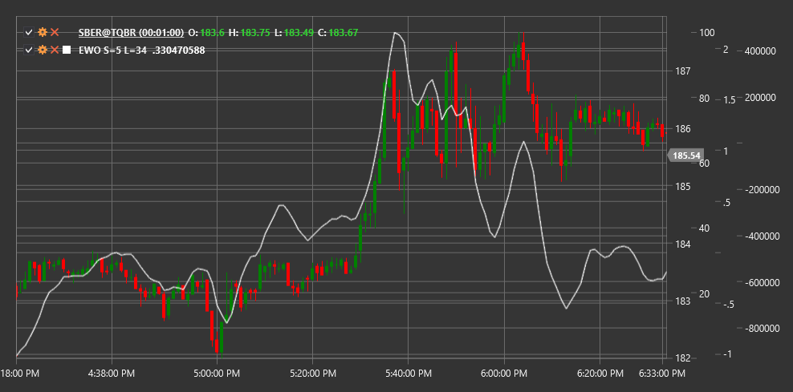

# EWO

**Elliot Wave Oscillator (EWO)** is a technical indicator based on Elliott Wave Theory that helps traders determine wave structure and potential market reversal points.

To use the indicator, you need to use the [ElliotWaveOscillator](xref:StockSharp.Algo.Indicators.ElliotWaveOscillator) class.

## Description

The Elliot Wave Oscillator (EWO) was developed to help traders apply Elliott Wave Theory in market analysis. Elliott Wave Theory assumes that markets move in predictable cycles consisting of five waves in the trend direction (impulse waves) and three waves against the trend (corrective waves).

EWO is based on the difference between fast and slow moving averages and is designed to identify impulse and corrective waves according to Elliott's theory. It helps determine when the market is in an impulse or corrective phase and suggests potential reversal points.

The Elliot Wave Oscillator is particularly useful for:
- Identifying the current Elliott wave structure
- Determining potential endings of impulse and corrective waves
- Confirming manual wave analysis
- Forecasting potential reversal points

## Parameters

The indicator has the following parameters:
- **ShortPeriod** - period for the short moving average (default value: 5)
- **LongPeriod** - period for the long moving average (default value: 35)

## Calculation

The Elliot Wave Oscillator calculation is quite simple:

```
EWO = EMA(Close, ShortPeriod) - EMA(Close, LongPeriod)
```

Where:
- EMA - exponential moving average
- Close - closing price
- ShortPeriod - short period (usually 5)
- LongPeriod - long period (usually 35)

## Interpretation

The Elliot Wave Oscillator can be interpreted as follows:

1. **Positive and Negative Values**:
   - Positive values (EWO above zero) indicate that the short EMA is above the long EMA, often corresponding to a bullish trend or upward impulse wave
   - Negative values (EWO below zero) indicate that the short EMA is below the long EMA, often corresponding to a bearish trend or downward impulse wave

2. **Zero Line Crossovers**:
   - Crossing the zero line from bottom to top may signal the start of a new upward impulse wave
   - Crossing the zero line from top to bottom may signal the start of a new downward impulse wave

3. **Oscillator Extremes**:
   - Peaks and troughs of the oscillator may correspond to the end of impulse waves
   - A corrective phase often follows reaching an extreme

4. **Divergences**:
   - Bullish divergence (price forms a new low, while EWO forms a higher low) may indicate a potential end of a downward impulse wave
   - Bearish divergence (price forms a new high, while EWO forms a lower high) may indicate a potential end of an upward impulse wave

5. **Wave Structure**:
   - In impulse waves (waves 1, 3, 5), EWO typically shows strong values in the trend direction
   - In corrective waves (waves 2, 4, A, B, C), EWO typically shows weaker values or moves in a direction opposite to the main trend

6. **Wave 3 Identification**:
   - Wave 3, which is usually the strongest impulse wave in Elliott Wave Theory, is often characterized by the highest EWO values



## See Also

[EMA](ema.md)
[MACD](macd.md)
[ZigZag](zigzag.md)
[WaveTrendOscillator](wave_trend_oscillator.md)