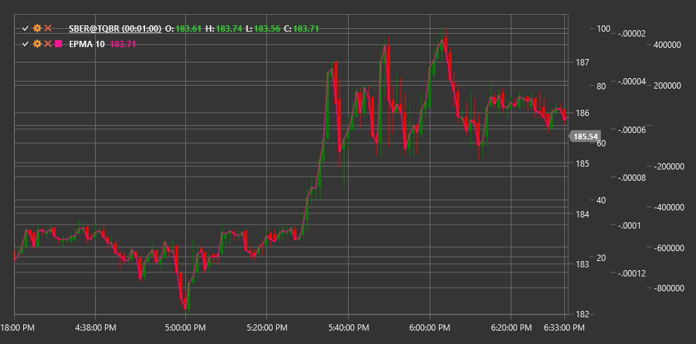

# EPMA

**Endpoint Moving Average (EPMA)** is a technical indicator that is a modification of the standard moving average, designed to reduce lag in trend identification.

To use the indicator, you need to use the [EndpointMovingAverage](xref:StockSharp.Algo.Indicators.EndpointMovingAverage) class.

## Description

The Endpoint Moving Average (EPMA) is a special form of moving average that focuses on the endpoint data points. Unlike standard moving averages that evenly weight all points in a given period, EPMA gives more weight to the endpoint points, allowing for faster response to trend changes.

The main purpose of EPMA is to reduce the lag inherent in traditional moving averages while maintaining the ability to filter market noise. Due to its calculation methodology, EPMA often reacts more quickly to price direction changes, making it a valuable tool for traders seeking to identify trend reversals earlier.

EPMA is particularly useful for:
- Earlier identification of trend changes
- Reducing signal lag
- Creating more sensitive trading systems
- Confirming signals from other indicators with less delay

## Parameters

The indicator has the following parameters:
- **Length** - calculation period (default value: 14)

## Calculation

Endpoint Moving Average calculation is based on linear regression method, focusing on the endpoint points of the considered period:

1. Determining the linear trend between the initial and final points of the period:
   ```
   Start Value = Price[current - Length + 1]
   End Value = Price[current]
   ```

2. Calculating the slope of the trend line:
   ```
   Slope = (End Value - Start Value) / (Length - 1)
   ```

3. Computing EPMA as a projection of the trend line to the current point:
   ```
   EPMA = Start Value + Slope * (Length - 1)
   ```

In fact, EPMA is equal to the last price value (End Value) in the considered period, but conceptually it is a projection of the linear trend defined by the endpoint points.

## Interpretation

The Endpoint Moving Average is interpreted similarly to other moving averages, but with consideration of its increased sensitivity:

1. **EPMA Direction**:
   - Upward EPMA indicates an upward trend
   - Downward EPMA indicates a downward trend

2. **Crossovers with Price**:
   - When price crosses EPMA from bottom to top, it can be viewed as a bullish signal
   - When price crosses EPMA from top to bottom, it can be viewed as a bearish signal

3. **Multiple EPMA Crossovers**:
   - Crossing of a short EPMA with a long EPMA from bottom to top may indicate the start of an upward trend
   - Crossing of a short EPMA with a long EPMA from top to bottom may indicate the start of a downward trend

4. **Divergence with Other Moving Averages**:
   - Due to its increased sensitivity, EPMA may react to trend changes earlier than traditional moving averages
   - Divergence between EPMA and other types of moving averages can serve as an early warning of a potential trend change

5. **Signal Filtering**:
   - Due to its increased sensitivity, EPMA may generate more false signals during sideways consolidation periods
   - It is recommended to use additional filters or confirmations from other indicators to improve signal reliability



## See Also

[SMA](sma.md)
[EMA](ema.md)
[ZLEMA](zero_lag_exponential_moving_average.md)
[DEMA](dema.md)