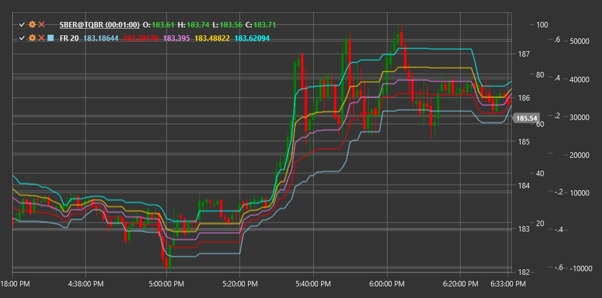

# FR

**Fibonacci Retracement (FR)** is a technical indicator based on Fibonacci numbers that helps identify potential support and resistance levels based on previous price movement.

To use the indicator, you need to use the [FibonacciRetracement](xref:StockSharp.Algo.Indicators.FibonacciRetracement) class.

## Description

Fibonacci Retracement is a popular technical tool that uses horizontal lines to indicate areas of possible support or resistance on a price chart. These levels are based on Fibonacci numbers and their corresponding percentage ratios.

The indicator is based on the Fibonacci mathematical sequence, where each number is the sum of the two preceding ones (1, 1, 2, 3, 5, 8, 13, 21, 34...). From this sequence, key ratios used in technical analysis are derived: 23.6%, 38.2%, 50%, 61.8%, and 78.6%.

Fibonacci Retracement is applied to a significant price movement (trend) and shows the levels where a correction (pullback) may occur before continuing in the direction of the main trend.

The indicator is particularly useful for:
- Identifying potential support levels in an upward trend
- Identifying potential resistance levels in a downward trend
- Setting entry targets after a correction
- Determining levels for stop-loss placement

## Parameters

The indicator has the following parameters:
- **Length** - period for determining a significant price movement (default value depends on the timeframe)

## Calculation

Calculating Fibonacci Retracement levels involves the following steps:

1. Determining a significant price movement (trend):
   - In an upward trend: from low to high
   - In a downward trend: from high to low

2. Calculating correction levels based on the range of this movement:
   ```
   Range = |High - Low|
   
   Level 0% = High (for upward trend) or Low (for downward trend)
   Level 23.6% = High - (Range * 0.236) or Low + (Range * 0.236)
   Level 38.2% = High - (Range * 0.382) or Low + (Range * 0.382)
   Level 50.0% = High - (Range * 0.5) or Low + (Range * 0.5)
   Level 61.8% = High - (Range * 0.618) or Low + (Range * 0.618)
   Level 78.6% = High - (Range * 0.786) or Low + (Range * 0.786)
   Level 100% = Low (for upward trend) or High (for downward trend)
   ```

## Interpretation

Fibonacci Retracement levels are interpreted as follows:

1. **Main Correction Levels**:
   - 23.6% - weak level, often broken during a strong trend
   - 38.2% - moderate level, corresponds to a typical correction
   - 50.0% - psychologically significant level (though not a Fibonacci number)
   - 61.8% - "golden ratio", the most important Fibonacci level
   - 78.6% - deep correction, may signal a potential trend reversal

2. **In an Upward Trend**:
   - Fibonacci levels serve as potential support levels
   - Bouncing off a Fibonacci level can be a signal to enter a long position
   - Breaking several Fibonacci levels downward may indicate trend weakening

3. **In a Downward Trend**:
   - Fibonacci levels serve as potential resistance levels
   - Bouncing off a Fibonacci level can be a signal to enter a short position
   - Breaking several Fibonacci levels upward may indicate trend weakening

4. **Coincidence with Other Levels**:
   - Fibonacci levels are more significant when they coincide with other important levels (previous highs/lows, moving averages, etc.)

5. **Plotting on Different Timeframes**:
   - Fibonacci levels plotted on different timeframes can create clustering zones where the probability of reversal increases



## See Also

[FibonacciExtensions](fibonacci_extensions.md)
[FibonacciFan](fibonacci_fan.md)
[FibonacciTimeZones](fibonacci_time_zones.md)
[PivotPoints](pivot_points.md)