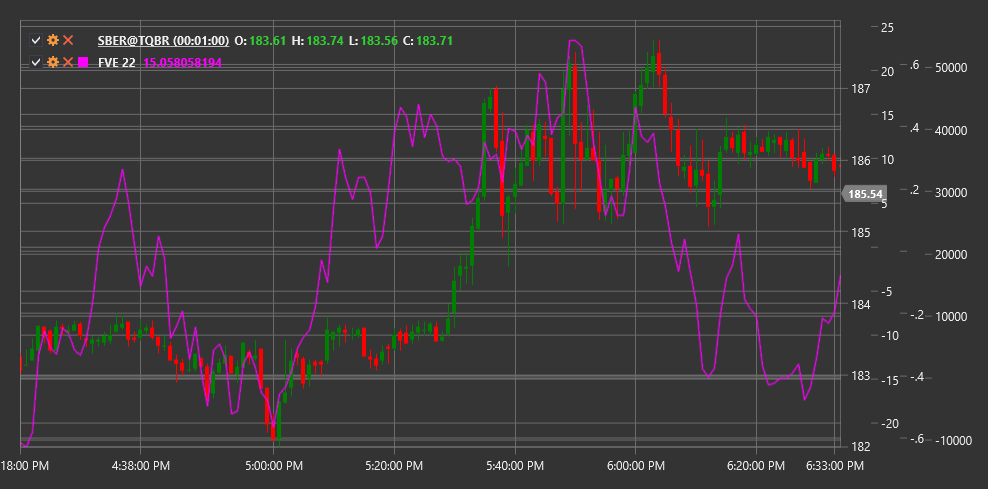

# FVE

**Finite Volume Element (FVE)** is a technical indicator developed to analyze the relationship between price and volume, helping to assess buyer and seller pressure in the market.

To use the indicator, you need to use the [FiniteVolumeElement](xref:StockSharp.Algo.Indicators.FiniteVolumeElement) class.

## Description

The Finite Volume Element (FVE) analyzes the relationship between price changes and trading volumes to determine the potential strength of price movement. It is based on the assumption that price changes are most significant when they are confirmed by corresponding volumes.

The FVE indicator converts price change, weighted by volume, into an oscillator that helps determine the relative balance between buyers and sellers in the market. Positive FVE values indicate buyer predominance, while negative values indicate seller predominance.

FVE is particularly useful for:
- Assessing the strength and sustainability of the current trend
- Identifying potential reversal points
- Determining divergences between price and volume
- Confirming signals from other indicators

## Parameters

The indicator has the following parameters:
- **Length** - smoothing period (default value: 22)

## Calculation

FVE indicator calculation involves several steps:

1. Calculate typical price for current and previous periods:
   ```
   Typical Price = (High + Low + Close) / 3
   ```

2. Calculate typical price change:
   ```
   Price Change = Typical Price[current] - Typical Price[previous]
   ```

3. Calculate volume-weighted price change:
   ```
   Volume-Weighted Price Change = Price Change * Volume[current]
   ```

4. Normalize to account for market scale:
   ```
   Normalized Value = Volume-Weighted Price Change / (Average Volume over period * Price Volatility)
   ```

5. Cumulative summation and smoothing:
   ```
   FVE = SMA(Cumulative Sum of Normalized Values, Length)
   ```

Where:
- High, Low, Close - highest, lowest, and closing prices
- Volume - trading volume
- SMA - simple moving average
- Length - smoothing period

## Interpretation

The FVE indicator can be interpreted as follows:

1. **Zero Line Crossovers**:
   - Transition from negative to positive values indicates increased buyer pressure and can be viewed as a bullish signal
   - Transition from positive to negative values indicates increased seller pressure and can be viewed as a bearish signal

2. **Extreme Values**:
   - High positive values (above +3) may indicate market overbought conditions
   - High negative values (below -3) may indicate market oversold conditions

3. **Divergences**:
   - Bullish divergence (price forms a new low, while FVE forms a higher low) may signal a potential upward reversal
   - Bearish divergence (price forms a new high, while FVE forms a lower high) may signal a potential downward reversal

4. **Trend Confirmation**:
   - Consistently positive FVE values confirm the strength of an upward trend
   - Consistently negative FVE values confirm the strength of a downward trend

5. **FVE Change Rate**:
   - Rapid increase or decrease in FVE values may indicate strong price movement momentum
   - Slowing of FVE value changes may signal potential momentum deceleration

6. **Support and Resistance Levels**:
   - Historical reversal points on the FVE chart can serve as guidelines for future reversals



## See Also

[OBV](obv.md)
[ADL](accumulation_distribution_line.md)
[ForceIndex](force_index.md)
[ChaikinMoneyFlow](chaikin_money_flow.md)