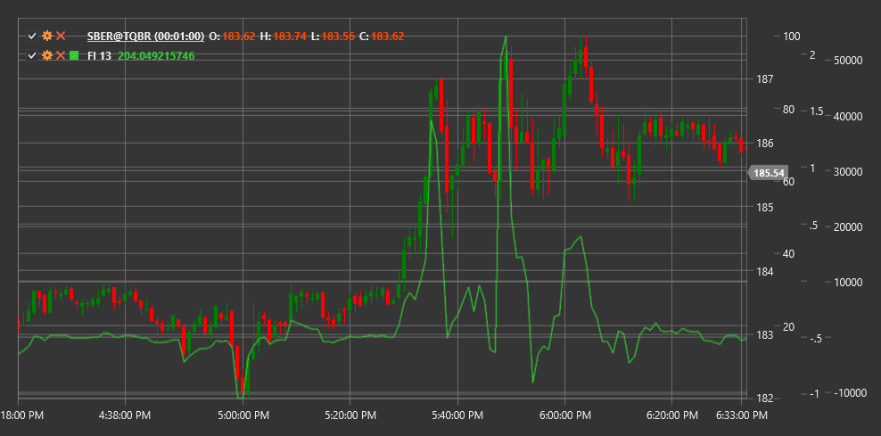

# FI

**Force Index (FI)** is a technical indicator developed by Dr. Alexander Elder that measures the strength of each price movement based on its direction, magnitude, and trading volume.

To use the indicator, you need to use the [ForceIndex](xref:StockSharp.Algo.Indicators.ForceIndex) class.

## Description

The Force Index is an oscillator that measures the strength of "bulls" (buyers) or "bears" (sellers) in each price movement. It combines three important elements of market information: price movement direction, movement magnitude, and trading volume.

The main idea of the indicator is that the larger the price change and the larger the trading volume, the stronger the market movement. Positive Force Index values indicate buyer predominance (bullish pressure), while negative values indicate seller predominance (bearish pressure).

The Force Index is particularly useful for:
- Determining the strength of the current trend
- Identifying potential reversal points
- Confirming breakouts
- Detecting divergences between price and movement strength

## Parameters

The indicator has the following parameters:
- **Length** - smoothing period (default value: 13)

## Calculation

Force Index calculation involves the following steps:

1. Calculating single-period Force Index:
   ```
   1-Period Force Index = (Close[current] - Close[previous]) * Volume[current]
   ```

2. Smoothing using Exponential Moving Average (EMA):
   ```
   Force Index = EMA(1-Period Force Index, Length)
   ```

Where:
- Close - closing price
- Volume - trading volume
- EMA - exponential moving average
- Length - smoothing period

## Interpretation

The Force Index can be interpreted in various ways:

1. **Zero Line Crossovers**:
   - Transition from negative to positive values indicates increased bullish pressure and can be viewed as a buy signal
   - Transition from positive to negative values indicates increased bearish pressure and can be viewed as a sell signal

2. **Extreme Values**:
   - High positive values indicate strong bullish pressure that may lead to market overbought conditions
   - High negative values indicate strong bearish pressure that may lead to market oversold conditions

3. **Divergences**:
   - Bullish Divergence (price forms a new low, while Force Index forms a higher low) may signal a potential upward reversal
   - Bearish Divergence (price forms a new high, while Force Index forms a lower high) may signal a potential downward reversal

4. **Trend Confirmation**:
   - Consistently positive Force Index values confirm the strength of an upward trend
   - Consistently negative Force Index values confirm the strength of a downward trend

5. **Triple Use** (according to Elder):
   - Short-term Force Index (2-day): for identifying short-term opportunities
   - Medium-term Force Index (13-day): for determining medium-term trends and corrections
   - Long-term Force Index (100-day): for identifying the main trend

6. **Correction Identification**:
   - In an upward trend, days with negative Force Index may indicate temporary corrections
   - In a downward trend, days with positive Force Index may indicate temporary bounces



## See Also

[EMA](ema.md)
[OBV](on_balance_volume.md)
[ADL](accumulation_distribution_line.md)