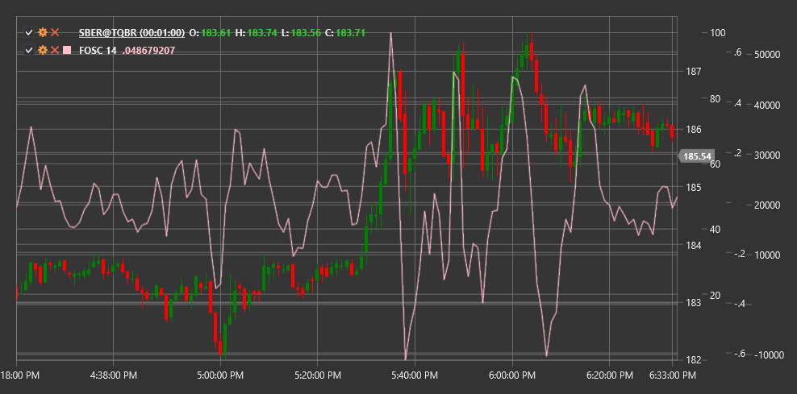

# FOSC

**Forecast Oscillator (FOSC)** is a technical indicator that measures the deviation of price from its predicted value obtained through linear regression, representing this deviation as a percentage.

To use the indicator, you need to use the [ForecastOscillator](xref:StockSharp.Algo.Indicators.ForecastOscillator) class.

## Description

The Forecast Oscillator (FOSC) is based on linear regression and designed to measure the degree of deviation of the current price from its predicted value. It helps traders assess how closely the current price corresponds to the expected trend or deviates from it.

The indicator calculates a trend line using linear regression over a specified period, then compares the actual closing price with the predicted value on this line. The difference is expressed as a percentage, making FOSC an oscillator that fluctuates around the zero line.

The Forecast Oscillator is particularly useful for:
- Determining the degree of price alignment with the expected trend
- Identifying potential reversal points
- Detecting extreme price deviations from the trend
- Identifying periods when price moves faster or slower than expected

## Parameters

The indicator has the following parameters:
- **Length** - period for linear regression calculation (default value: 14)

## Calculation

Forecast Oscillator calculation involves the following steps:

1. Calculate the forecast line using linear regression over the specified period:
   ```
   Forecast = Linear Regression Line(Close, Length)
   ```

2. Calculate the oscillator as a percentage ratio between current price and forecast value:
   ```
   FOSC = ((Close - Forecast) / Forecast) * 100
   ```

Where:
- Close - current closing price
- Forecast - predicted value obtained through linear regression
- Length - period for linear regression calculation

## Interpretation

The Forecast Oscillator is interpreted as follows:

1. **Deviation from Zero**:
   - Positive values (FOSC > 0) indicate that the current price is above the predicted value, which may suggest a stronger upward movement than expected
   - Negative values (FOSC < 0) indicate that the current price is below the predicted value, which may suggest a stronger downward movement than expected

2. **Extreme Values**:
   - Very high positive values may indicate market overbought conditions relative to the trend
   - Very low negative values may indicate market oversold conditions relative to the trend

3. **Return to Zero**:
   - Movement of FOSC from extreme values towards zero may signal a potential return of price to its trend line

4. **Zero Line Crossovers**:
   - Crossing the zero line from bottom to top can be viewed as a bullish signal
   - Crossing the zero line from top to bottom can be viewed as a bearish signal

5. **Divergences**:
   - Bullish Divergence (price forms a new low, while FOSC forms a higher low) may indicate a potential upward reversal
   - Bearish Divergence (price forms a new high, while FOSC forms a lower high) may indicate a potential downward reversal

6. **Trend Confirmation**:
   - If FOSC moves in the same direction as price, this confirms the strength of the current trend
   - If FOSC moves in the opposite direction to price, this may indicate a weakening of the current trend



## See Also

[LinearRegression](lrc.md)
[LRR2](lrr2.md)
[StandardError](standard_error.md)
[DisparityIndex](disparity_index.md)