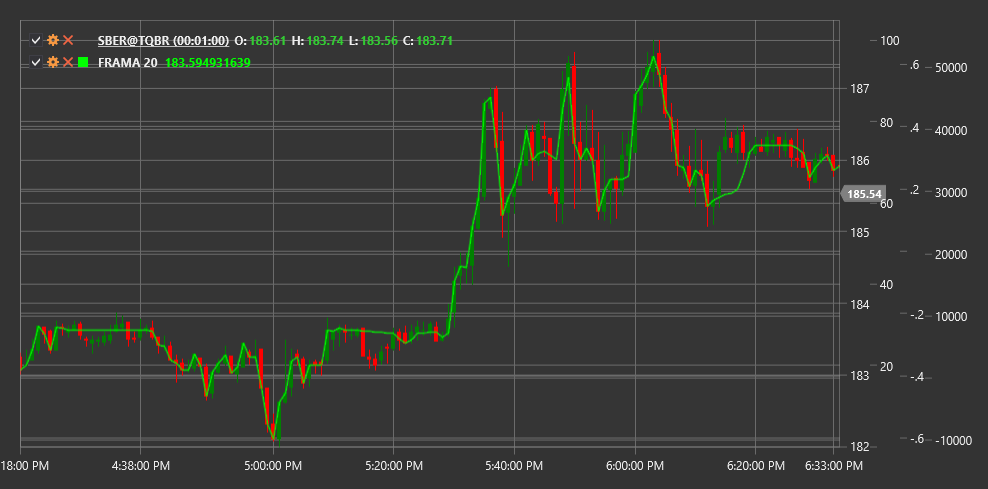

# FRAMA

**Fractal Adaptive Moving Average (FRAMA)** is a technical indicator developed by John Ehlers that adapts the rate of reaction to price changes based on the market's fractal dimension.

To use the indicator, you need to use the [FractalAdaptiveMovingAverage](xref:StockSharp.Algo.Indicators.FractalAdaptiveMovingAverage) class.

## Description

The Fractal Adaptive Moving Average (FRAMA) is an advanced type of Exponential Moving Average (EMA) that automatically adjusts its sensitivity to price changes based on the market's fractal dimension. The indicator was developed by John Ehlers and introduced in the Technical Analysis of Stocks & Commodities magazine in October 2000.

FRAMA uses the concept of fractal geometry to analyze market structure. It determines how "fractal" or chaotic the current market is, and based on this, adjusts the indicator's response rate:

- In trending (less fractal) market conditions, FRAMA responds quickly to price changes, similar to a short EMA
- In sideways (more fractal) market conditions, FRAMA responds more slowly, similar to a long EMA

This allows FRAMA to respond faster to significant price movements and ignore market noise, making it more effective compared to traditional moving averages.

## Parameters

The indicator has the following parameters:
- **Length** - calculation period (default value: 10-20)

## Calculation

FRAMA calculation involves several steps:

1. Calculate fractal dimension (D) based on the logarithmic ratio of high-low price length to the number of periods:
   ```
   N1 = High(1...Length/2) - Low(1...Length/2)
   N2 = High(Length/2+1...Length) - Low(Length/2+1...Length)
   N3 = High(1...Length) - Low(1...Length)
   
   D = (log(N1 + N2) - log(N3)) / log(2)
   ```

2. Convert fractal dimension to alpha factor for exponential smoothing:
   ```
   Smoothing Factor = exp(-4.6 * (D - 1))
   Alpha = Smoothing Factor * Smoothing Factor
   ```

3. Apply alpha factor to current price and previous FRAMA value:
   ```
   FRAMA = Alpha * Price + (1 - Alpha) * FRAMA[previous]
   ```

Where:
- High - maximum price for the period
- Low - minimum price for the period
- log - natural logarithm

## Interpretation

FRAMA can be interpreted similarly to other moving averages, but with consideration of its adaptive nature:

1. **FRAMA Direction**:
   - Upward FRAMA indicates an upward trend
   - Downward FRAMA indicates a downward trend

2. **Crossovers with Price**:
   - When price crosses FRAMA from bottom to top, it can be viewed as a bullish signal
   - When price crosses FRAMA from top to bottom, it can be viewed as a bearish signal

3. **Multiple FRAMA Crossovers**:
   - Crossing of a short FRAMA with a long FRAMA from bottom to top may indicate the start of an upward trend
   - Crossing of a short FRAMA with a long FRAMA from top to bottom may indicate the start of a downward trend

4. **FRAMA Slope Angle**:
   - Steep slope angle indicates a strong trend
   - Shallow slope angle indicates a weak trend
   - Horizontal movement indicates a sideways trend

5. **Signal Filtering**:
   - Due to its adaptive nature, FRAMA creates fewer false signals than traditional moving averages
   - The shorter the FRAMA period, the more sensitive the indicator will be to price changes

6. **Support and Resistance Levels**:
   - FRAMA can serve as a dynamic support level in an upward trend
   - FRAMA can serve as a dynamic resistance level in a downward trend



## See Also

[EMA](ema.md)
[KAMA](kama.md)
[VIDYA](vidya.md)