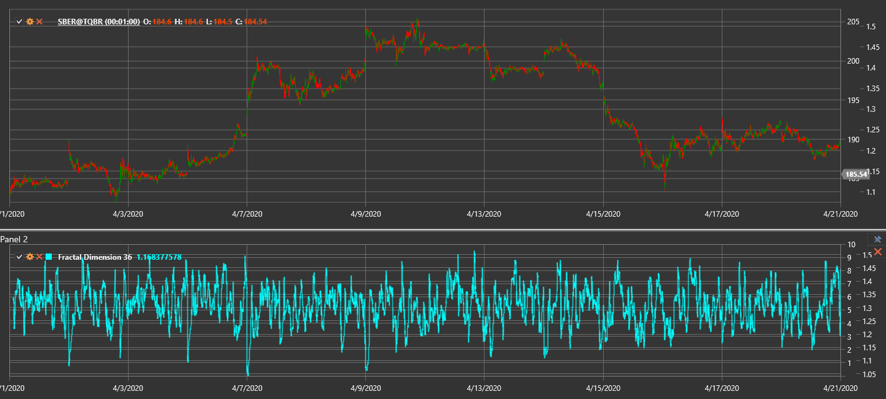

# FDI

**Fractal Dimension Index (FDI)** quantifies the roughness of a price series.

To use the indicator, you need to use the [FractalDimension](xref:StockSharp.Algo.Indicators.FractalDimension) class.

## Description

The FDI ranges from 1 to 2 and reflects market behavior:
- Values near 1 indicate a persistent trend (smoother path).
- Values around 1.5 correspond to a random walk.
- Values close to 2 denote a ranging or noisy market.

The indicator is based on fractal geometry and measures how complex the price path is.

## Parameters

The indicator has the following parameter:
- **Length** – calculation period (default value: 30)

## Calculation

FDI is computed by comparing the total price path length with the overall high-low range:

1. Sum absolute differences between consecutive prices over the period to get the price path length.
2. Find the difference between the maximum high and minimum low for the period.
3. Calculate FDI using:
   ```
   FDI = 1 + (log(PathLength) - log(Range)) / log(2 * (Length - 1))
   ```
4. Clamp the result between 1 and 2.

## Interpretation

- **FDI near 1** – strong trending behavior.
- **FDI around 1.5** – random walk; trend strength is neutral.
- **FDI closer to 2** – choppy or sideways market.



## See Also

[Hurst Exponent](hurst_exponent.md)

[Fractal Adaptive Moving Average](fractal_adaptive_moving_average.md)
