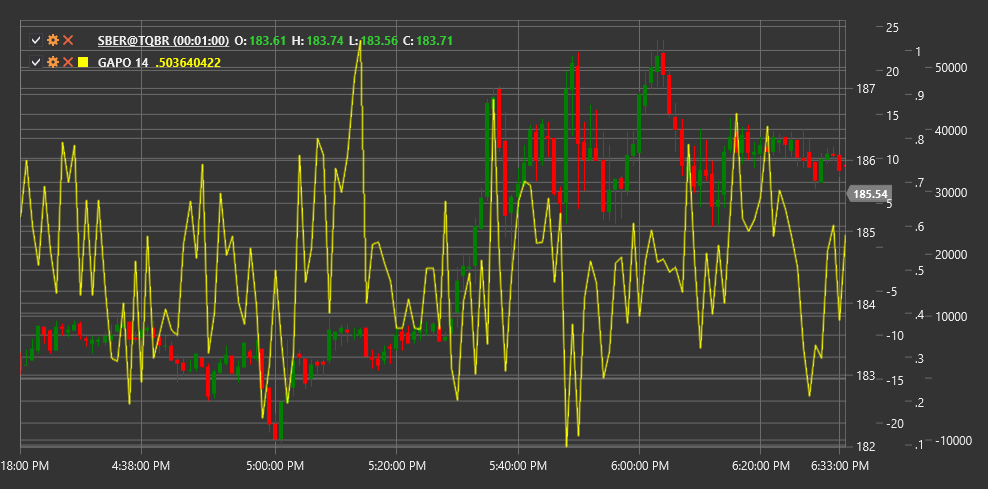

# GAPO

**Gopalakrishnan Range Index (GAPO)** is a technical indicator developed by Tushar Gopalakrishnan to measure market volatility using a logarithmic scale.

To use the indicator, you need to use the [GopalakrishnanRangeIndex](xref:StockSharp.Algo.Indicators.GopalakrishnanRangeIndex) class.

## Description

The Gopalakrishnan Range Index (GAPO) is a volatility indicator that uses a logarithmic scale to measure the overall price range over a specific period. It was developed by Tushar Gopalakrishnan and presented in the "Technical Analysis of Stocks & Commodities" magazine.

GAPO evaluates extreme market movements by measuring the logarithmic ratio between the maximum and minimum prices over a given period. This approach allows the indicator to more accurately reflect increased volatility, especially during periods of sharp price movements.

The GAPO indicator is particularly useful for:
- Identifying periods of high and low volatility
- Detecting potential reversal points after extreme movements
- Adjusting parameters for other volatility-based indicators
- Adapting trading strategies to current market conditions

## Parameters

The indicator has the following parameters:
- **Length** - calculation period (default value: 10)

## Calculation

The Gopalakrishnan Range Index calculation is quite simple:

```
GAPO = log(N) * log(Highest High - Lowest Low)
```

Where:
- log - natural logarithm
- N - number of periods (Length)
- Highest High - highest high over the Length period
- Lowest Low - lowest low over the Length period

## Interpretation

The Gopalakrishnan Range Index can be interpreted as follows:

1. **Absolute Values**:
   - High GAPO values indicate periods of high volatility
   - Low GAPO values indicate periods of low volatility
   - Extremely high values may indicate possible market overextension and potential reversal

2. **GAPO Trends**:
   - Increasing GAPO values indicate increasing volatility
   - Decreasing GAPO values indicate decreasing volatility
   - A sharp GAPO jump may signal the beginning of a new trend movement

3. **Relative Levels**:
   - Comparing the current GAPO value with its historical levels allows assessment of relative volatility
   - Values above the 95th percentile of the historical range may indicate extreme volatility
   - Values below the 5th percentile of the historical range may indicate unusually low volatility

4. **Trading Strategies**:
   - During high volatility periods (high GAPO values), it may be appropriate to increase stop-loss and target profit sizes
   - During low volatility periods (low GAPO values), range trading strategies may be more suitable
   - Extreme GAPO values can be used as contrary indicators for finding reversal points

5. **Combination with Other Indicators**:
   - GAPO can be used to filter signals from other indicators
   - During high volatility periods, trend indicator signals may be more reliable
   - During low volatility periods, oscillator signals may be more effective



## See Also

[ATR](atr.md)
[ChoppinessIndex](choppiness_index.md)
[TrueRange](true_range.md)