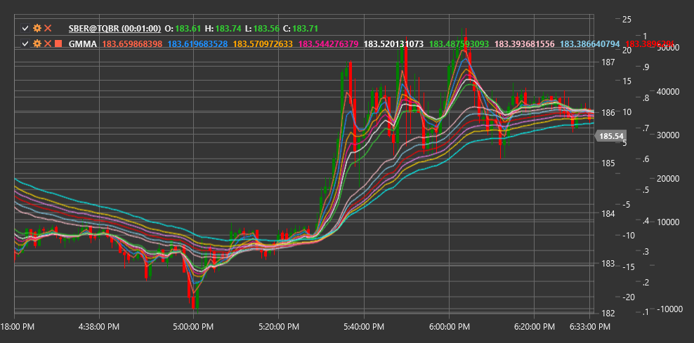

# GMMA

**Guppy Multiple Moving Average (GMMA)** is a technical indicator developed by Daryl Guppy that uses two groups of exponential moving averages (EMA) to reveal the interaction between short-term traders and long-term investors.

To use the indicator, you need to use the [GuppyMultipleMovingAverage](xref:StockSharp.Algo.Indicators.GuppyMultipleMovingAverage) class.

## Description

The Guppy Multiple Moving Average (GMMA) consists of two groups of exponential moving averages (EMA):
1. **Short-term group** (typically 3, 5, 8, 10, 12, and 15 periods) - represents short-term traders' activity
2. **Long-term group** (typically 30, 35, 40, 45, 50, and 60 periods) - represents long-term investors' activity

GMMA allows visualization of the interaction between these two market participant groups and determines whether the market is in a trending or consolidation state. The indicator also helps identify moments when short-term traders begin to follow the same direction as long-term investors, which often indicates the formation or strengthening of a trend.

GMMA is particularly useful for:
- Determining the strength and direction of the current trend
- Identifying potential trend reversals
- Recognizing when the market transitions from consolidation to a trend
- Determining optimal entry points into an existing trend

## Calculation

GMMA calculation involves computing two groups of exponential moving averages:

1. Short-term EMA group:
   ```
   EMA_3 = EMA(Price, 3)
   EMA_5 = EMA(Price, 5)
   EMA_8 = EMA(Price, 8)
   EMA_10 = EMA(Price, 10)
   EMA_12 = EMA(Price, 12)
   EMA_15 = EMA(Price, 15)
   ```

2. Long-term EMA group:
   ```
   EMA_30 = EMA(Price, 30)
   EMA_35 = EMA(Price, 35)
   EMA_40 = EMA(Price, 40)
   EMA_45 = EMA(Price, 45)
   EMA_50 = EMA(Price, 50)
   EMA_60 = EMA(Price, 60)
   ```

Where:
- EMA - exponential moving average
- Price - price (usually closing price)

## Interpretation

GMMA interpretation involves analyzing both individual groups and their interaction:

1. **Group Positioning**:
   - When the short-term group is above the long-term group, it indicates an upward trend
   - When the short-term group is below the long-term group, it indicates a downward trend

2. **Distance Between Groups**:
   - Large distance between groups indicates a strong trend
   - Small distance or group crossover indicates a weak trend or consolidation

3. **Compression and Expansion**:
   - Compression (convergence) of lines within a group indicates uncertainty and possible consolidation
   - Expansion (divergence) of lines within a group indicates trend strengthening

4. **Crossovers**:
   - Short-term group crossing through long-term group from bottom to top - strong bullish signal
   - Short-term group crossing through long-term group from top to bottom - strong bearish signal

5. **Direction Changes**:
   - When the long-term group begins to change direction, it indicates a significant change in long-term investor sentiment
   - Short-term group reversal without changes in the long-term group often indicates a temporary correction

6. **Optimal Entry Points**:
   - After strong expansion, compression may occur, indicating a correction within the trend
   - The end of such compression (new expansion) can be a good entry point in the direction of the main trend

7. **Early Reversal Warning**:
   - Short-term averages change direction first, then changes begin to appear in long-term averages
   - Crossover between groups can serve as a trend reversal confirmation



## See Also

[EMA](ema.md)
[MovingAverageRibbon](moving_average_ribbon.md)
[RainbowCharts](rainbow_charts.md)
[MACD](macd.md)