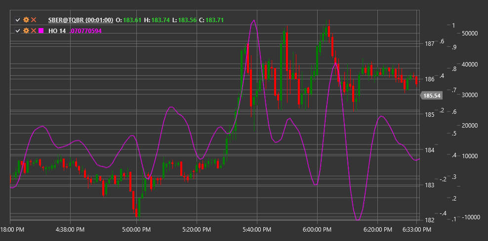

# HO

**Harmonic Oscillator (HO)** is a technical indicator based on harmonic oscillation theory that helps identify cyclical components in price movement.

To use the indicator, you need to use the [HarmonicOscillator](xref:StockSharp.Algo.Indicators.HarmonicOscillator) class.

## Description

The Harmonic Oscillator (HO) is an indicator developed to identify periodicity and cyclical nature of market price movements. It is based on the principle that many price movements contain harmonic (periodic) components that can be isolated and used to forecast future price movements.

The indicator applies spectral analysis methods to decompose the price series into harmonic components, highlighting dominant cycles. It then displays these cyclical components as an oscillator that helps traders determine when price may reach local maximums or minimums within the identified cycles.

HO is particularly useful for:
- Determining the cyclical nature of the market
- Identifying potential reversal points
- Filtering market noise
- Predicting moments when price may change direction

## Parameters

The indicator has the following parameters:
- **Length** - analysis period (default value: 30)

## Calculation

Harmonic Oscillator calculation involves the following steps:

1. Price series preprocessing (detrending):
   ```
   Detrended Price = Price - SMA(Price, Length)
   ```

2. Applying spectral analysis to identify dominant cycles:
   ```
   Spectral Components = FFT(Detrended Price)
   ```
   
3. Extracting the most significant harmonic components:
   ```
   Dominant Cycles = Extract Top N Spectral Components based on amplitude
   ```

4. Synthesizing the Harmonic Oscillator based on dominant cycles:
   ```
   HO = Reconstruction of Dominant Cycles through Inverse FFT
   ```

Where:
- Price - price (usually closing price)
- SMA - simple moving average
- FFT - Fast Fourier Transform
- Length - analysis period

## Interpretation

The Harmonic Oscillator can be interpreted as follows:

1. **Zero Line Crossovers**:
   - When HO crosses the zero line from bottom to top, it can be viewed as a bullish signal
   - When HO crosses the zero line from top to bottom, it can be viewed as a bearish signal

2. **Oscillator Extremes**:
   - When HO reaches a local maximum, it may indicate a potential price peak
   - When HO reaches a local minimum, it may indicate a potential price bottom

3. **Divergences**:
   - Bullish Divergence: price forms a new low, while HO forms a higher low
   - Bearish Divergence: price forms a new high, while HO forms a lower high

4. **Cycle Projection**:
   - Regular HO peaks and troughs can be used to project future reversal points
   - Analyzing the duration between peaks/troughs can help determine the dominant cycle length

5. **Amplitude Changes**:
   - Increased HO oscillation amplitude may indicate strengthening of the cyclical component
   - Decreased HO oscillation amplitude may indicate attenuation of the cyclical component

6. **Combination with Other Indicators**:
   - HO works best in combination with trend indicators
   - In trending markets, HO signals can be used to determine entry points in the trend direction



## See Also

[SineWave](sine_wave.md)
[CenterOfGravityOscillator](center_of_gravity_oscillator.md)
[FisherTransform](ehlers_fisher_transform.md)
[DetrendedSyntheticPrice](detrended_synthetic_price.md)