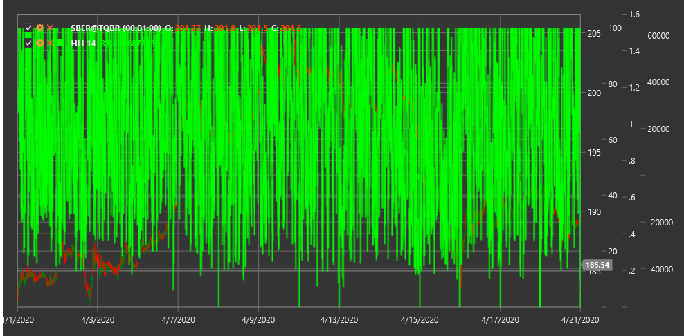

# HLI

**High Low Index (HLI)** is a technical indicator that measures the ratio of the number of stocks reaching new highs to the number of stocks reaching new lows over a specific period of time.

To use the indicator, you need to use the [HighLowIndex](xref:StockSharp.Algo.Indicators.HighLowIndex) class.

## Description

The High Low Index (HLI) is a market breadth indicator that analyzes overall market activity by comparing the number of instruments reaching new highs with the number reaching new lows. This allows for assessing the internal strength or weakness of the market.

The main idea of the indicator is that a healthy market is characterized by more securities reaching new highs than new lows. Conversely, a weakening market will have more securities reaching new lows.

HLI is particularly useful for:
- Assessing the overall market condition
- Identifying divergences between the index and individual market instruments
- Determining potential market reversal points
- Confirming signals from other indicators

## Parameters

The indicator has the following parameters:
- **Length** - calculation period (default value: 14)

## Calculation

High Low Index calculation involves the following steps:

1. Count the number of securities reaching new highs over the Length period:
   ```
   New Highs = Number of instruments reaching new highs over the Length period
   ```

2. Count the number of securities reaching new lows over the Length period:
   ```
   New Lows = Number of instruments reaching new lows over the Length period
   ```

3. Calculate High Low Index as the ratio of the difference between new highs and lows to their sum:
   ```
   HLI = ((New Highs - New Lows) / (New Highs + New Lows)) * 100
   ```

Note: If (New Highs + New Lows) equals zero, HLI is set to zero to avoid division by zero.

## Interpretation

The High Low Index is interpreted as follows:

1. **Value Range**:
   - HLI oscillates between -100 and +100
   - Positive values indicate more securities reaching new highs than new lows
   - Negative values indicate more securities reaching new lows than new highs

2. **Zero Line Crossovers**:
   - Transition from negative to positive values can be viewed as a bullish signal
   - Transition from positive to negative values can be viewed as a bearish signal

3. **Extreme Values**:
   - Values close to +100 indicate a strong bullish market (possible overbought condition)
   - Values close to -100 indicate a strong bearish market (possible oversold condition)

4. **Divergences**:
   - Bullish Divergence: market index reaches a new low, but HLI forms a higher low
   - Bearish Divergence: market index reaches a new high, but HLI forms a lower high

5. **HLI Trends**:
   - Sustained HLI growth indicates strengthening of a bullish market
   - Sustained HLI decline indicates strengthening of a bearish market

6. **Market Trend Confirmation**:
   - If the market index rises and HLI also rises, this confirms the strength of an upward trend
   - If the market index falls and HLI also falls, this confirms the strength of a downward trend



## See Also

[McClellanOscillator](mcclellan_oscillator.md)