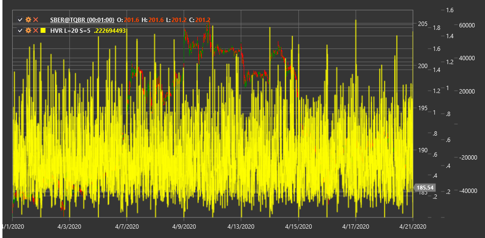

# HVR

**Historical Volatility Ratio (HVR)** is a technical indicator that compares short-term historical volatility with long-term historical volatility to assess changes in market activity.

To use the indicator, you need to use the [HistoricalVolatilityRatio](xref:StockSharp.Algo.Indicators.HistoricalVolatilityRatio) class.

## Description

The Historical Volatility Ratio (HVR) is a relative volatility indicator that compares short-term volatility with long-term market volatility. The indicator helps determine whether current volatility is increasing or decreasing relative to its historical level.

HVR is calculated as the ratio of short-term historical volatility to long-term historical volatility. Values above 1.0 indicate that current (short-term) volatility is higher than long-term volatility, which may signal increased market activity or a potential trend change.

The indicator is particularly useful for:
- Identifying periods of high and low volatility
- Determining potential trend reversal points
- Adapting trading strategies to current market conditions
- Assessing market risk and setting appropriate position sizes

## Parameters

The indicator has the following parameters:
- **ShortPeriod** - period for calculating short-term volatility (default value: 5)
- **LongPeriod** - period for calculating long-term volatility (default value: 20)

## Calculation

Historical Volatility Ratio calculation involves the following steps:

1. Calculate short-term historical volatility:
   ```
   Short-term Volatility = Standard Deviation of Log Returns over ShortPeriod * Sqrt(Trading Days Per Year)
   ```

2. Calculate long-term historical volatility:
   ```
   Long-term Volatility = Standard Deviation of Log Returns over LongPeriod * Sqrt(Trading Days Per Year)
   ```

3. Calculate HVR as the ratio of short-term volatility to long-term volatility:
   ```
   HVR = Short-term Volatility / Long-term Volatility
   ```

Where:
- Log Returns - logarithmic returns (ln(Price[i] / Price[i-1]))
- Standard Deviation - standard deviation
- Trading Days Per Year - number of trading days in a year (usually 252 for stock markets)
- ShortPeriod - short period for volatility calculation
- LongPeriod - long period for volatility calculation

## Interpretation

The Historical Volatility Ratio can be interpreted as follows:

1. **Level 1.0**:
   - HVR = 1.0 means short-term volatility is equal to long-term volatility
   - HVR > 1.0 indicates short-term volatility is higher than long-term volatility
   - HVR < 1.0 indicates short-term volatility is lower than long-term volatility

2. **Extreme Values**:
   - Very high HVR values (e.g., > 2.0) may indicate a sharp volatility increase, often occurring during market panics or strong movements
   - Very low HVR values (e.g., < 0.5) may indicate a volatility compression period, often preceding strong movements

3. **HVR Trends**:
   - Rising HVR indicates an increase in current volatility
   - Falling HVR indicates a decrease in current volatility

4. **Trading Strategies**:
   - When HVR is high, it may be appropriate to use breakout-based strategies
   - When HVR is low, mean reversion or range trading strategies may be more suitable

5. **Risk Management**:
   - High HVR values may signal the need to reduce position sizes due to increased volatility
   - Low HVR values may allow increased position sizes due to reduced volatility

6. **Potential Reversals**:
   - Extreme HVR values often precede significant price movements
   - A sharp HVR increase after a low volatility period may signal the start of a new trend



## See Also

[ATR](atr.md)
[StandardDeviation](standard_deviation.md)
[ChoppinessIndex](choppiness_index.md)