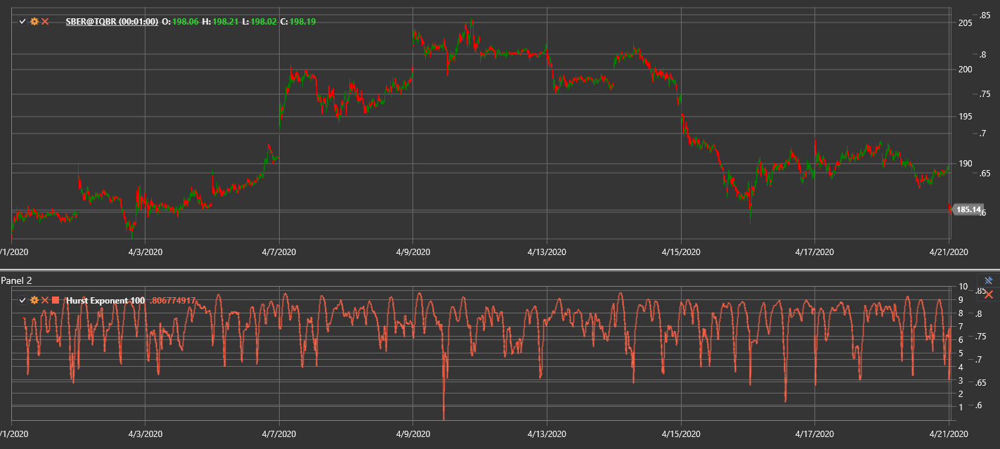

# HurstExponent

**Hurst Exponent** is a statistical measure used to evaluate the tendency of a time series to either trend or revert to the mean.

To use the indicator, you need to use the [HurstExponent](xref:StockSharp.Algo.Indicators.HurstExponent) class.

## Description

The Hurst exponent (H) ranges between 0 and 1 and describes the long-term memory of a series:
- **H > 0.5** indicates persistent trending behaviour.
- **H < 0.5** shows a tendency toward mean reversion.
- **H ≈ 0.5** corresponds to a random walk.

It can help estimate market efficiency and reveal emerging cycles or trends.

## Parameters

- **Length** – the number of bars used in the calculation.

## Calculation

A common method is based on the rescaled range (R/S) approach:
1. For each window of `Length` points, compute cumulative deviations from the mean.
2. Find the range `R` as the difference between maximum and minimum cumulative deviation.
3. Calculate the standard deviation `S` of the window.
4. Evaluate the rescaled range `R/S`.
5. Estimate `H` as the slope of `log(R/S)` against `log(Length)`.

Higher values of the exponent suggest stronger trending behaviour, while lower values imply greater mean reversion.

## See Also

[Fractal Adaptive Moving Average](fractal_adaptive_moving_average.md)
[Market Meanness Index](market_meanness_index.md)
