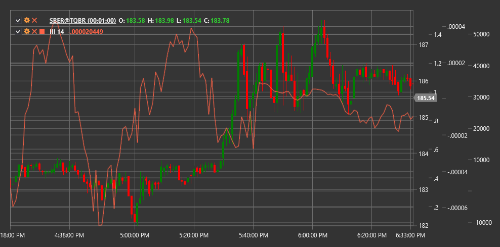

# III

**Intraday Intensity Index (III)** is a technical indicator developed by David Bostian that assesses the relationship between closing price, price range, and trading volume within a trading day.

To use the indicator, you need to use the [IntradayIntensityIndex](xref:StockSharp.Algo.Indicators.IntradayIntensityIndex) class.

## Description

The Intraday Intensity Index (III) combines information about price movement and trading volume to evaluate the intensity of buying or selling pressure within a trading day. The indicator is based on the assumption that the position of the closing price relative to the day's price range, combined with volume, can indicate the direction and strength of market movement.

III is particularly useful for identifying intraday changes in market sentiment and determining potential reversal points. Positive indicator values indicate buying pressure (closing price closer to the day's high), while negative values indicate selling pressure (closing price closer to the day's low).

The Intraday Intensity Index is especially effective for:
- Identifying intraday changes in market sentiment
- Determining potential reversal points
- Confirming signals from other indicators
- Assessing the strength of the current trend

## Parameters

The indicator has the following parameters:
- **Length** - smoothing period (default value: 14)

## Calculation

Intraday Intensity Index calculation involves the following steps:

1. Calculate individual III value for each period:
   ```
   III raw = ((2 * Close - High - Low) / ((High - Low) * Volume)) * Volume
   ```

2. Smooth using a simple moving average:
   ```
   III = SMA(III raw, Length)
   ```

Where:
- Close - closing price
- High - period's highest price
- Low - period's lowest price
- Volume - trading volume
- SMA - simple moving average
- Length - smoothing period

## Interpretation

The Intraday Intensity Index can be interpreted as follows:

1. **Zero Line Crossovers**:
   - Transition from negative to positive values can be viewed as a bullish signal, indicating increased buying pressure
   - Transition from positive to negative values can be viewed as a bearish signal, indicating increased selling pressure

2. **Extreme Values**:
   - High positive values indicate strong buying pressure
   - High negative values indicate strong selling pressure
   - Extreme values may indicate market overbought or oversold conditions

3. **Divergences**:
   - Bullish Divergence: price forms a new low, while III forms a higher low
   - Bearish Divergence: price forms a new high, while III forms a lower high

4. **III Trends**:
   - Consistently positive III values confirm an upward trend
   - Consistently negative III values confirm a downward trend
   - Oscillations around the zero line may indicate a sideways trend or uncertainty

5. **Combining with Other Indicators**:
   - III is often used in combination with other technical indicators to confirm signals
   - Particularly effective when combined with trend and volume indicators

6. **Changes in Values**:
   - Rapid change from negative to positive values may indicate a sharp shift in market sentiment
   - Gradual convergence towards the zero line may indicate a weakening of current momentum



## See Also

[IntradayMomentumIndex](intraday_momentum_index.md)
[BalanceOfPower](balance_of_power.md)
[ForceIndex](force_index.md)
[ChaikinMoneyFlow](chaikin_money_flow.md)