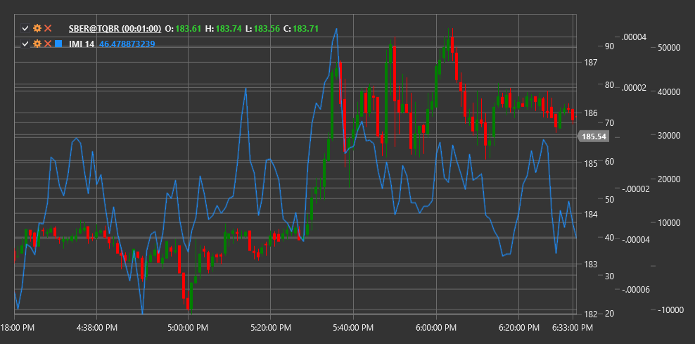

# IMI

**Intraday Momentum Index (IMI)** is a technical indicator developed by Tushar Chande that combines intraday pricing principles and the RSI concept to measure intraday momentum.

To use the indicator, you need to use the [IntradayMomentumIndex](xref:StockSharp.Algo.Indicators.IntradayMomentumIndex) class.

## Description

The Intraday Momentum Index (IMI) was created as a modification of the classic Relative Strength Index (RSI), specifically adapted for analyzing intraday market dynamics. Instead of using sequential closing prices, like in traditional RSI, IMI compares the closing price with the opening price for each period.

IMI evaluates how often and how strongly the closing price exceeds the opening price (positive momentum) or falls below the opening price (negative momentum) over a given period. This allows identifying the predominant direction and strength of intraday movement.

The indicator is particularly useful for:
- Determining the intraday market direction
- Identifying potential reversal points
- Determining overbought and oversold levels
- Detecting divergences between price and momentum

## Parameters

The indicator has the following parameters:
- **Length** - calculation period (default value: 14)

## Calculation

Intraday Momentum Index calculation involves the following steps:

1. Determine intraday price movement:
   ```
   Gain = Close - Open, if Close > Open
   Loss = Open - Close, if Close < Open
   ```

2. Calculate the sum of positive and negative movements over the Length period:
   ```
   Sum Gains = Sum of all Gains over Length period
   Sum Losses = Sum of all Losses over Length period
   ```

3. Calculate IMI using a formula similar to RSI:
   ```
   IMI = 100 * (Sum Gains / (Sum Gains + Sum Losses))
   ```

Note: If (Sum Gains + Sum Losses) equals zero, IMI is set to 50 to avoid division by zero.

## Interpretation

The Intraday Momentum Index is interpreted similarly to RSI:

1. **Value Range**:
   - IMI oscillates between 0 and 100
   - Values above 50 indicate predominance of positive intraday momentum
   - Values below 50 indicate predominance of negative intraday momentum

2. **Overbought and Oversold Levels**:
   - Values above 70 are typically viewed as indicating market overbought conditions
   - Values below 30 are typically viewed as indicating market oversold conditions

3. **Centerline Crossovers**:
   - Crossing the 50 line from bottom to top can be viewed as a bullish signal
   - Crossing the 50 line from top to bottom can be viewed as a bearish signal

4. **Divergences**:
   - Bullish Divergence: price forms a new low, while IMI forms a higher low
   - Bearish Divergence: price forms a new high, while IMI forms a lower high

5. **Failed Swings**:
   - If IMI cannot reach the overbought level during an upward trend, this may indicate trend weakness
   - If IMI cannot reach the oversold level during a downward trend, this may indicate trend weakness

6. **Trend Confirmation**:
   - Sustained IMI values above 50 confirm an upward trend
   - Sustained IMI values below 50 confirm a downward trend



## See Also

[RSI](rsi.md)
[IntradayIntensityIndex](intraday_intensity_index.md)
[Momentum](momentum.md)
[RelativeMomentumIndex](relative_momentum_index.md)