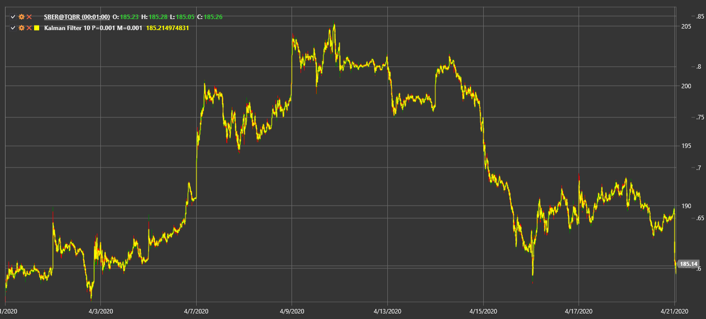

# KalmanFilter

**Kalman Filter** is a recursive algorithm that estimates the underlying state of a system from noisy observations.

To use the indicator, you need to use the [KalmanFilter](xref:StockSharp.Algo.Indicators.KalmanFilter) class.

## Description

The Kalman Filter applies a prediction-correction cycle to smooth price data and reduce market noise. It adapts dynamically as new information becomes available, making it useful for tracking trends in volatile markets.

## Parameters

- **ProcessNoise** – expected variance in the underlying process.
- **ObservationNoise** – expected variance in the observed data.

## Calculation

At each step the filter performs:
1. **Prediction** of the next state based on the previous estimate.
2. **Update** of this prediction using the newest price observation and the noise estimates.

This yields an optimized estimate that reacts quickly to price changes while filtering out short-term fluctuations.

## See Also

[Kaufman Adaptive Moving Average](kama.md)
[Adaptive Laguerre Filter](adaptive_laguerre_filter.md)
