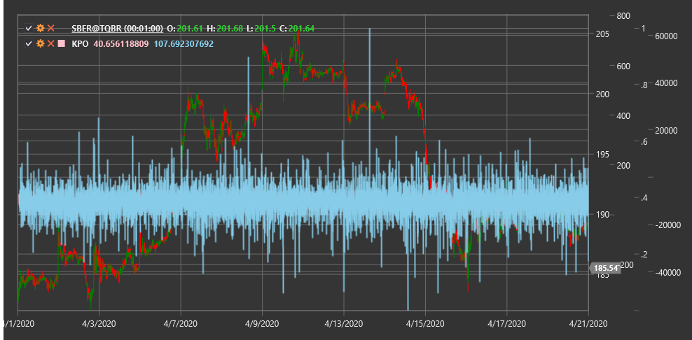

# KPO

**Kase Peak Oscillator (KPO)** is a technical indicator developed by Celia Kase that combines momentum and volatility to identify potential market peaks and troughs.

To use the indicator, you need to use the [KasePeakOscillator](xref:StockSharp.Algo.Indicators.KasePeakOscillator) class.

## Description

The Kase Peak Oscillator (KPO) is a tool for determining overbought and oversold market conditions and identifying potential reversal points. It was developed by trader and engineer Celia Kase as part of her trading methodology.

KPO is based on the concept that market peaks and troughs form when the price movement momentum begins to exhaust. The oscillator uses a combination of momentum and volatility indicators to identify these key turning points.

The indicator is a dimensionless oscillator that fluctuates around the zero line. Positive values indicate upward momentum, while negative values indicate downward momentum. Extreme oscillator values often coincide with peaks and troughs on the price chart.

## Parameters

The indicator has the following parameters:
- **ShortPeriod** - short period for momentum calculation (default value: 10)
- **LongPeriod** - long period for momentum calculation (default value: 30)

## Calculation

Kase Peak Oscillator calculation involves several steps:

1. Calculate short-term momentum based on the short period:
   ```
   Short Momentum = EMA(Price, ShortPeriod) - EMA(Price, ShortPeriod)[previous]
   ```

2. Calculate long-term momentum based on the long period:
   ```
   Long Momentum = EMA(Price, LongPeriod) - EMA(Price, LongPeriod)[previous]
   ```

3. Calculate current volatility:
   ```
   Volatility = ATR(ShortPeriod)
   ```

4. Normalize momentum relative to volatility:
   ```
   Normalized Short Momentum = Short Momentum / Volatility
   Normalized Long Momentum = Long Momentum / Volatility
   ```

5. Final KPO calculation:
   ```
   KPO = Normalized Short Momentum - Normalized Long Momentum
   ```

Where:
- Price - usually closing price
- EMA - exponential moving average
- ATR - average true range
- ShortPeriod - short calculation period
- LongPeriod - long calculation period

## Interpretation

The Kase Peak Oscillator can be interpreted as follows:

1. **Zero Line Crossovers**:
   - Crossing from bottom to top can be viewed as a bullish signal
   - Crossing from top to bottom can be viewed as a bearish signal

2. **Extreme Values**:
   - High positive values may indicate market overbought conditions and a potential downward reversal
   - High negative values may indicate market oversold conditions and a potential upward reversal

3. **Divergences**:
   - Bullish Divergence (price forms a new low, while KPO forms a higher low) may signal an upcoming upward reversal
   - Bearish Divergence (price forms a new high, while KPO forms a lower high) may signal an upcoming downward reversal

4. **Component Crossovers**:
   - When short-term momentum crosses long-term momentum from bottom to top, it can be viewed as a bullish signal
   - When short-term momentum crosses long-term momentum from top to bottom, it can be viewed as a bearish signal

5. **Acceleration and Deceleration**:
   - Increased KPO slope indicates momentum acceleration
   - Decreased KPO slope indicates momentum deceleration, which may precede a reversal

6. **Combining with Other Indicators**:
   - KPO is often used with other technical indicators to confirm signals
   - Particularly effective when combined with trend indicators and support/resistance levels



## See Also

[MomentumOscillator](momentum.md)
[MACD](macd.md)
[PrettyGoodOscillator](pretty_good_oscillator.md)
[ATR](atr.md)