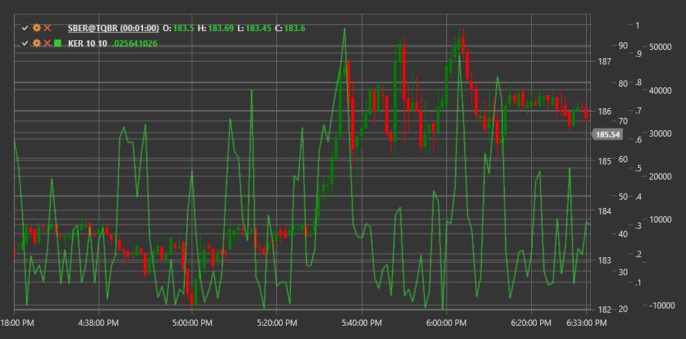

# KER

**Kaufman Efficiency Ratio (KER)** is a technical indicator developed by Perry Kaufman that measures price movement efficiency by comparing directional price movement to overall volatility.

To use the indicator, you need to use the [KaufmanEfficiencyRatio](xref:StockSharp.Algo.Indicators.KaufmanEfficiencyRatio) class.

## Description

The Kaufman Efficiency Ratio (KER) evaluates how "efficiently" price moves in a specific direction compared to the total path it travels. It represents the ratio of net directional price movement to the sum of all price changes over a specific period.

KER was developed by Perry Kaufman and was originally used as a component of the Adaptive Moving Average (KAMA). However, KER itself is a valuable tool that helps determine whether the market is in a trending or oscillating state.

KER values oscillate between 0 and 1:
- Values close to 1 indicate highly efficient price movement (strong trend)
- Values close to 0 indicate inefficient price movement (sideways market or high volatility)

## Parameters

The indicator has the following parameters:
- **Length** - period for efficiency calculation (default value: 10)

## Calculation

Kaufman Efficiency Ratio calculation involves the following steps:

1. Calculate directional movement (net change) over the period:
   ```
   Direction = |Price[current] - Price[current - Length]|
   ```

2. Calculate total movement (sum of all changes) over the period:
   ```
   Volatility = Sum(|Price[i] - Price[i-1]|) for i from (current - Length + 1) to current
   ```

3. Calculate efficiency ratio:
   ```
   KER = Direction / Volatility
   ```

Where:
- Price - usually closing price
- Length - calculation period
- | | - denotes absolute value

If Volatility is zero (which is unlikely), KER is set to zero to avoid division by zero.

## Interpretation

The Kaufman Efficiency Ratio can be interpreted as follows:

1. **Efficiency Levels**:
   - High KER values (>0.6) indicate a strong trend
   - Medium KER values (0.3-0.6) indicate a moderate trend
   - Low KER values (<0.3) indicate a sideways market or high volatility

2. **KER Changes**:
   - KER growth may signal the formation or strengthening of a trend
   - KER decline may signal trend weakening or transition to sideways movement

3. **Trading Strategies**:
   - During high efficiency periods (high KER), trend strategies are preferable
   - During low efficiency periods (low KER), range trading strategies are preferable

4. **Signal Filtering**:
   - KER can be used to filter signals from other indicators
   - Trend indicator signals are more reliable at high KER
   - Oscillator signals are more reliable at low KER

5. **Market Condition Adaptation**:
   - KER allows adapting trading strategies to changing market conditions
   - Traders can dynamically adjust parameters of other indicators based on KER values

6. **Change Precursor**:
   - Sharp KER changes often precede new price movements
   - KER decline after a period of high values may warn of a potential trend reversal



## See Also

[KAMA](kama.md)
[ADX](adx.md)
[VHF](vhf.md)
[VIDYA](vidya.md)