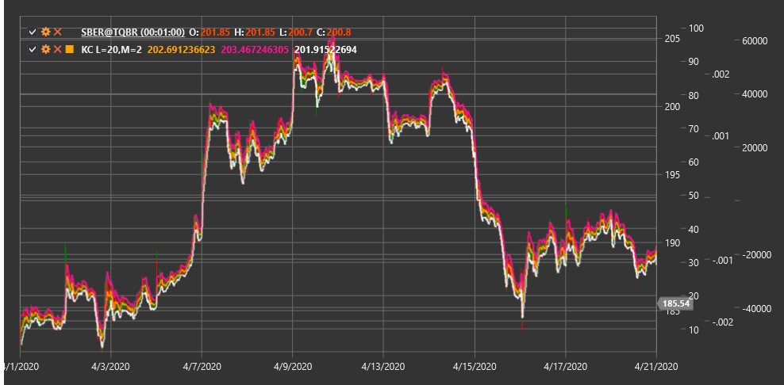

# KC

**Keltner Channels (KC)** is a technical indicator consisting of a set of volatility bands that uses an exponential moving average (EMA) as the central line and the average true range (ATR) to determine channel width.

To use the indicator, you need to use the [KeltnerChannels](xref:StockSharp.Algo.Indicators.KeltnerChannels) class.

## Description

Keltner Channels consist of three lines:
1. **Central Line**: typically represented by a 20-period EMA
2. **Upper Band**: central line plus a multiplier of ATR
3. **Lower Band**: central line minus the same ATR multiplier

The indicator was developed by Chester Keltner in the 1960s and later modified by Linda Raschke, who replaced the simple moving average (SMA) with an exponential moving average (EMA) and began using ATR instead of the High-Low range to calculate channel width.

Keltner Channels help traders determine trend direction and potential support and resistance levels. They are also used to identify overbought and oversold conditions when price touches or breaks through the upper or lower band, respectively.

## Parameters

The indicator has the following parameters:
- **Length** - period for calculating EMA and ATR (default value: 20)
- **Multiplier** - multiplier for ATR, determining channel width (default value: 2.0)

## Calculation

Keltner Channels calculation involves the following steps:

1. Calculate exponential moving average:
   ```
   Middle Line = EMA(Price, Length)
   ```

2. Calculate average true range:
   ```
   ATR = Average True Range over Length period
   ```

3. Calculate upper and lower bands:
   ```
   Upper Band = Middle Line + (Multiplier * ATR)
   Lower Band = Middle Line - (Multiplier * ATR)
   ```

Where:
- Price - usually closing price
- EMA - exponential moving average
- ATR - average true range
- Length - period for EMA and ATR calculation
- Multiplier - multiplier determining channel width

## Interpretation

Keltner Channels can be interpreted as follows:

1. **Trend Direction**:
   - When all three lines are pointing upward, this indicates an upward trend
   - When all three lines are pointing downward, this indicates a downward trend
   - Horizontal line movement indicates a sideways trend

2. **Breakouts**:
   - Price breaking above the upper band may indicate strong upward momentum
   - Price breaking below the lower band may indicate strong downward momentum
   - Breakouts are often used as entry signals in the direction of the breakout

3. **Returns to Middle Line**:
   - After breaking the upper or lower band, price often returns to the middle line
   - The middle line can serve as a support or resistance level

4. **Overbought and Oversold Conditions**:
   - Price near or beyond the upper band may indicate overbought conditions
   - Price near or beyond the lower band may indicate oversold conditions
   - In trending markets, price can remain in "extreme" zones for extended periods

5. **Channel Contraction and Expansion**:
   - Channel narrowing (decreasing distance between bands) indicates decreased volatility, often preceding a strong price movement
   - Channel expansion indicates increased volatility

6. **Trading Strategies**:
   - "Edge to Middle" strategy: opening a position when price touches the upper or lower band, targeting the middle line
   - Breakout strategy: opening a position when price breaks the upper or lower band, expecting continued movement in the same direction
   - "Middle to Edge" strategy: opening a position when price bounces from the middle line, targeting the upper or lower band



## See Also

[BollingerBands](bollinger_bands.md)
[DonchianChannels](donchian_channels.md)
[EMA](ema.md)
[ATR](atr.md)