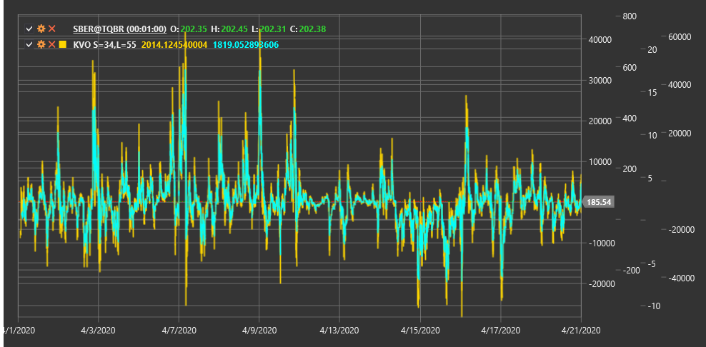

# KVO

**Klinger Volume Oscillator (KVO)** is a technical indicator developed by Stephen Klinger that uses volume and price to identify long-term trends and short-term reversals in the market.

To use the indicator, you need to use the [KlingerVolumeOscillator](xref:StockSharp.Algo.Indicators.KlingerVolumeOscillator) class.

## Description

The Klinger Volume Oscillator (KVO) was created by Stephen Klinger to measure the divergence between volume and price. The indicator is based on the concept that price movement is confirmed by volume. KVO seeks to determine not only the trend direction but also its strength and potential reversal points.

KVO combines price information with volume using a Volume Force indicator that considers both the direction and magnitude of price movement, as well as trading volume. It then applies exponential moving averages (EMA) with two different periods to this money flow and calculates the difference between them.

The indicator is an oscillator that fluctuates above and below the zero line. Positive KVO values indicate that buyers control the market, while negative values indicate that sellers have an advantage.

## Parameters

The indicator has the following parameters:
- **ShortPeriod** - period for calculating short EMA (default value: 34)
- **LongPeriod** - period for calculating long EMA (default value: 55)

## Calculation

Klinger Volume Oscillator calculation involves several steps:

1. Determine trend for each period:
   ```
   Trend = +1, if (High + Low + Close) > (High[previous] + Low[previous] + Close[previous])
   Trend = -1, otherwise
   ```

2. Calculate Volume Force indicator:
   ```
   Volume Force = Volume * Trend * abs(2 * ((Close - Low) - (High - Close)) / (High - Low))
   ```
   If (High - Low) is zero, Volume Force is set to volume multiplied by trend.

3. Calculate EMA for two periods:
   ```
   Short EMA = EMA(Volume Force, ShortPeriod)
   Long EMA = EMA(Volume Force, LongPeriod)
   ```

4. Final KVO calculation:
   ```
   KVO = Short EMA - Long EMA
   ```

5. Calculate signal line (optional):
   ```
   Signal Line = EMA(KVO, 13)
   ```

Where:
- High, Low, Close - highest, lowest, and closing prices
- Volume - trading volume
- EMA - exponential moving average
- ShortPeriod - period for short EMA
- LongPeriod - period for long EMA

## Interpretation

The Klinger Volume Oscillator can be interpreted as follows:

1. **Zero Line Crossovers**:
   - KVO crossing the zero line from bottom to top can be viewed as a bullish signal
   - KVO crossing the zero line from top to bottom can be viewed as a bearish signal

2. **Signal Line Crossovers**:
   - KVO crossing the signal line from bottom to top can be viewed as a bullish entry signal
   - KVO crossing the signal line from top to bottom can be viewed as a bearish entry signal

3. **Divergences**:
   - Bullish Divergence: price forms a new low, while KVO forms a higher low
   - Bearish Divergence: price forms a new high, while KVO forms a lower high

4. **Trend Confirmation**:
   - Positive KVO values confirm an upward trend
   - Negative KVO values confirm a downward trend

5. **Trend Strength**:
   - Increasing KVO value (both positive and negative) indicates strengthening of the current trend
   - Decreasing KVO value indicates weakening of the current trend

6. **Potential Reversals**:
   - Extreme KVO values may indicate market overbought or oversold conditions and potential reversal
   - Slowdown in KVO rise or fall may precede a trend reversal

7. **Volume and Price**:
   - KVO allows assessment of price and volume movement consistency
   - Strong volume in the trend direction leads to more extreme KVO values



## See Also

[OBV](obv.md)
[ChaikinMoneyFlow](chaikin_money_flow.md)
[ADL](accumulation_distribution_line.md)
[ForceIndex](force_index.md)