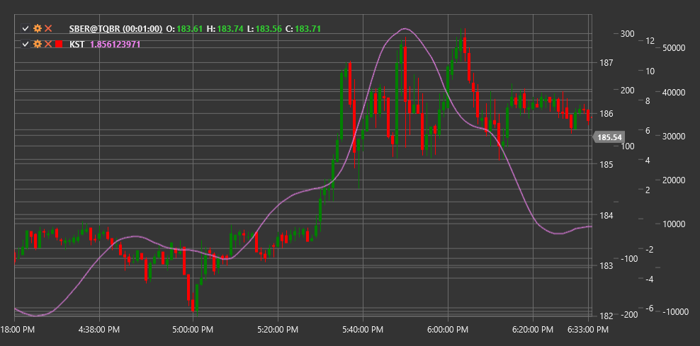

# KST

**Know Sure Thing (KST)** is a technical indicator developed by Martin Pring that represents the sum of four smoothed rates of change (ROC) with different periods to identify long-term market cycles.

To use the indicator, you need to use the [KnowSureThing](xref:StockSharp.Algo.Indicators.KnowSureThing) class.

## Description

The Know Sure Thing (KST) indicator is an oscillator developed by Martin Pring to identify trends by measuring price momentum across various time periods. The indicator combines four rate of change (ROC) measurements with different periods, giving more significance to longer periods.

KST is based on the theory that market cycles of different durations collectively influence price movement. By combining ROC from different periods, KST aims to identify long-term cyclical trends and determine potential reversal points.

The indicator is typically accompanied by a signal line (moving average of KST), and their crossovers can be used to generate trading signals.

## Calculation

KST indicator calculation involves the following steps:

1. Calculate four rate of change (ROC) measurements with different periods:
   ```
   ROC1 = ((Close / Close[n1 periods ago]) - 1) * 100
   ROC2 = ((Close / Close[n2 periods ago]) - 1) * 100
   ROC3 = ((Close / Close[n3 periods ago]) - 1) * 100
   ROC4 = ((Close / Close[n4 periods ago]) - 1) * 100
   ```

2. Smooth each ROC using a simple moving average (SMA):
   ```
   RCMA1 = SMA(ROC1, m1)
   RCMA2 = SMA(ROC2, m2)
   RCMA3 = SMA(ROC3, m3)
   RCMA4 = SMA(ROC4, m4)
   ```

3. Weighted summation to obtain KST:
   ```
   KST = (RCMA1 * 1) + (RCMA2 * 2) + (RCMA3 * 3) + (RCMA4 * 4)
   ```

4. Calculate signal line:
   ```
   Signal Line = SMA(KST, signal period)
   ```

Where:
- Close - closing price
- n1, n2, n3, n4 - periods for ROC calculation (default values: 10, 15, 20, 30)
- m1, m2, m3, m4 - periods for ROC smoothing (default values: 10, 10, 10, 15)
- signal period - signal line period (default value: 9)

## Interpretation

The KST indicator can be interpreted as follows:

1. **Zero Line Crossovers**:
   - When KST crosses the zero line from bottom to top, it can be viewed as a bullish signal
   - When KST crosses the zero line from top to bottom, it can be viewed as a bearish signal

2. **Signal Line Crossovers**:
   - When KST crosses the signal line from bottom to top, it can be viewed as a bullish signal (more sensitive than zero line crossing)
   - When KST crosses the signal line from top to bottom, it can be viewed as a bearish signal (more sensitive than zero line crossing)

3. **Divergences**:
   - Bullish Divergence: price forms a new low, while KST forms a higher low
   - Bearish Divergence: price forms a new high, while KST forms a lower high

4. **Extreme Values**:
   - High positive KST values may indicate market overbought conditions
   - High negative KST values may indicate market oversold conditions

5. **Movement Direction**:
   - Rising KST trend indicates an overall bullish market sentiment
   - Falling KST trend indicates an overall bearish market sentiment

6. **Trend Confirmation**:
   - KST can be used to confirm signals from other indicators
   - Consistency between KST direction and price confirms the strength of the current trend

7. **Market Sentiment Analysis**:
   - Positive KST values indicate predominance of bullish sentiment
   - Negative KST values indicate predominance of bearish sentiment



## See Also

[ROC](roc.md)
[MACD](macd.md)
[Momentum](momentum.md)
[RSI](rsi.md)