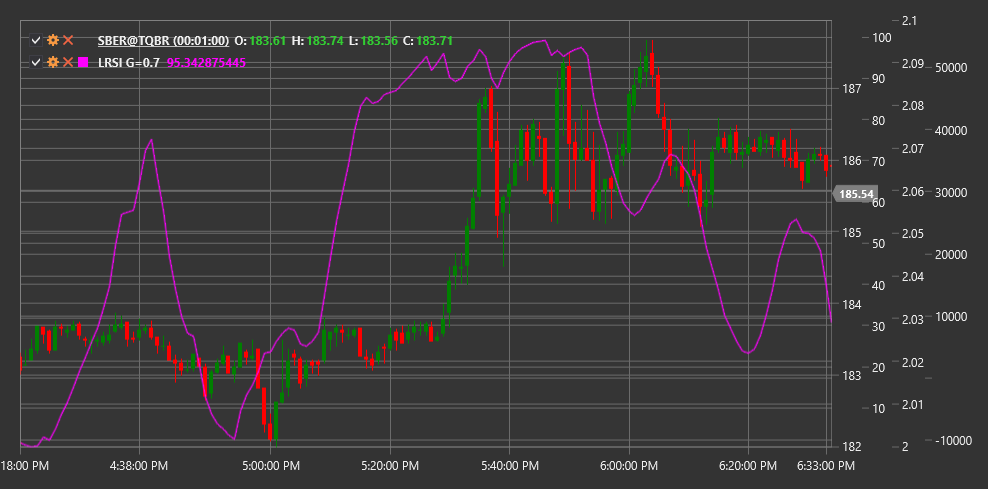

# LRSI

**Laguerre RSI (LRSI)** is a technical indicator based on Laguerre filter mathematical principles, developed by John Ehlers as an advanced version of the traditional Relative Strength Index (RSI).

To use the indicator, you need to use the [LaguerreRSI](xref:StockSharp.Algo.Indicators.LaguerreRSI) class.

## Description

Laguerre RSI (LRSI) is an innovative oscillator that uses Laguerre filter mathematics to create a more sensitive and less lagging indicator compared to traditional RSI. John Ehlers developed this indicator to address the signal delay problem inherent in many technical indicators.

LRSI combines Laguerre polynomial principles with the Relative Strength Index concept. This allows the indicator to respond more quickly to trend changes and form clearer trading signals. Like traditional RSI, LRSI oscillates between 0 and 1 (or 0 to 100 when multiplied by 100), but has a less noisy structure and more distinct turns.

The main advantage of LRSI is its ability to quickly identify trend changes while maintaining signal stability. This makes it particularly useful for short-term trading and determining entry and exit points.

## Parameters

The indicator has the following parameters:
- **Gamma** - filtering coefficient (default value: 0.4, range from 0.1 to 0.9)

The Gamma parameter determines the degree of filtering and affects the indicator's sensitivity. Lower Gamma values result in a smoother and less sensitive indicator, while higher values make the indicator more sensitive to price changes, but potentially more noisy.

## Calculation

Laguerre RSI calculation involves several steps:

1. Initialize four Laguerre filter values (L0, L1, L2, L3) on first run:
   ```
   L0 = L1 = L2 = L3 = 0
   ```

2. Update filter values for each new price:
   ```
   L0_new = (1 - Gamma) * Price + Gamma * L0_old
   L1_new = -Gamma * L0_new + L0_old + Gamma * L1_old
   L2_new = -Gamma * L1_new + L1_old + Gamma * L2_old
   L3_new = -Gamma * L2_new + L2_old + Gamma * L3_old
   ```

3. Calculate "cumulative multiplication" of filtered values:
   ```
   CU = (L0_new + L1_new + L2_new + L3_new) / 4
   ```

4. Separate into "up" and "down" components:
   ```
   If CU >= CU_old, then:
     UP = CU - CU_old
     DN = 0
   Otherwise:
     UP = 0
     DN = CU_old - CU
   ```

5. Final LRSI calculation:
   ```
   LRSI = UP / (UP + DN)
   ```
   
   If (UP + DN) is zero, LRSI is set to the previous value.

Where:
- Price - input price (usually closing price)
- Gamma - filtering parameter
- CU - "cumulative multiplication"

## Interpretation

Laguerre RSI is interpreted similarly to traditional RSI, but with its increased sensitivity:

1. **Overbought and Oversold Levels**:
   - Values above 0.8 (or 80) are typically considered overbought
   - Values below 0.2 (or 20) are typically considered oversold
   - Due to Laguerre filter characteristics, these levels may be adjusted based on market volatility

2. **Centerline Crossovers**:
   - Crossing the 0.5 (or 50) level from bottom to top can be viewed as a bullish signal
   - Crossing the 0.5 (or 50) level from top to bottom can be viewed as a bearish signal

3. **Divergences**:
   - Bullish Divergence: price forms a new low, while LRSI forms a higher low
   - Bearish Divergence: price forms a new high, while LRSI forms a lower high

4. **Rebounds from Extremes**:
   - LRSI reversal from overbought or oversold levels can serve as a market entry signal

5. **Trend Confirmation**:
   - LRSI values above 0.5 confirm an upward trend
   - LRSI values below 0.5 confirm a downward trend

6. **Gamma Parameter Tuning**:
   - For faster signals - increase Gamma (closer to 0.9)
   - For smoother signals - decrease Gamma (closer to 0.1)



## See Also

[RSI](rsi.md)
[AdaptiveLaguerreFilter](adaptive_laguerre_filter.md)
[StochasticRSI](stochastic_rsi.md)
[ConnorsRSI](connors_rsi.md)