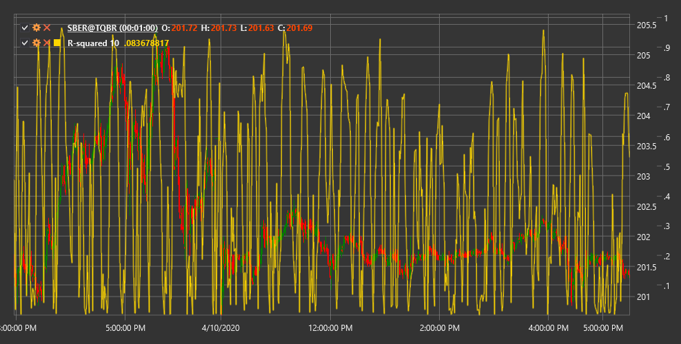

# R-Squared

**R-Squared in Linear Regression (Linear Regression R-Squared)** is a technical indicator that measures how well linear regression approximates price data and determines the strength of the market trend.

To use the indicator, you need to use the [LinearRegRSquared](xref:StockSharp.Algo.Indicators.LinearRegRSquared) class.

## Description

R-Squared in Linear Regression (R²) is a statistical measure used to evaluate the degree of correspondence between price data and a linear regression line drawn through these data. In the context of technical analysis, R² shows how well the current price movement corresponds to a linear trend.

R² values range from 0 to 1 (or 0% to 100%):
- A value close to 1 (100%) indicates that prices align very well along the trend line, signifying a strong trend
- A value close to 0 indicates the absence of a linear trend and is characteristic of sideways, chaotic, or cyclical markets

The indicator helps traders distinguish between periods of strong trends and periods of consolidation or sideways movements, allowing them to choose an appropriate trading strategy.

## Parameters

The indicator has the following parameters:
- **Length** - period for linear regression calculation (default value: 14)

## Calculation

R-Squared in Linear Regression calculation involves the following steps:

1. Constructing a linear regression line for price data over the Length period:
   ```
   y = a + b*x
   ```
   Where:
   - y - price (dependent variable)
   - x - period sequence number (independent variable)
   - a - free term (y-axis intercept)
   - b - slope coefficient

2. Calculating the sum of squared deviations from regression (SSE):
   ```
   SSE = Sum((Actual Price - Predicted Price)^2)
   ```
   Where:
   - Actual Price - actual price
   - Predicted Price - predicted price from the regression equation

3. Calculating the total sum of squares (SST):
   ```
   SST = Sum((Actual Price - Average Price)^2)
   ```
   Where Average Price is the mean price over the Length period

4. Calculating R²:
   ```
   R² = 1 - (SSE / SST)
   ```

## Interpretation

R-Squared in Linear Regression can be interpreted as follows:

1. **Trend Strength Assessment**:
   - Values above 0.7 (70%) indicate a strong trend
   - Values between 0.3 and 0.7 (30-70%) indicate a moderate trend
   - Values below 0.3 (30%) indicate a weak trend or no trend

2. **Trading Strategy Selection**:
   - With high R² values (strong trend), trend-following strategies are effective
   - With low R² values (sideways movement), range trading strategies are effective

3. **Transition Point Search**:
   - Increasing R² may signal the formation of a new trend
   - Decreasing R² may signal trend weakening and possible consolidation or reversal

4. **Signal Filtering**:
   - Signals from trend indicators are more reliable at high R² values
   - Oscillator signals are more reliable at low R² values

5. **Combining with Other Indicators**:
   - R² is often used to determine market mode, after which appropriate indicators are applied
   - For example, use moving averages with high R², and stochastic oscillator with low R²

6. **Market Predictability Assessment**:
   - High R² values indicate more predictable price movement in the short term
   - Low R² values indicate more chaotic, unpredictable movement

7. **Timeframes**:
   - R² can yield different results on different timeframes
   - Comparing R² across timeframes can provide additional information about market structure



## See Also

[LinearRegression](lrc.md)
[StandardError](standard_error.md)
[ChoppinessIndex](choppiness_index.md)