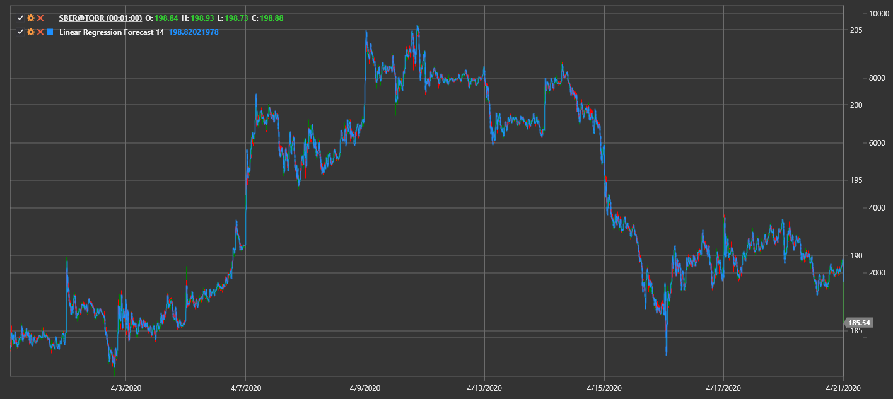

# Linear Regression Forecast

**Linear Regression Forecast (LRF)** predicts future price values based on linear regression over a selected period.

To use the indicator, you must use the [LinearRegressionForecast](xref:StockSharp.Algo.Indicators.LinearRegressionForecast) class.

## Recommended content

[Linear Regression](lrc.md)
