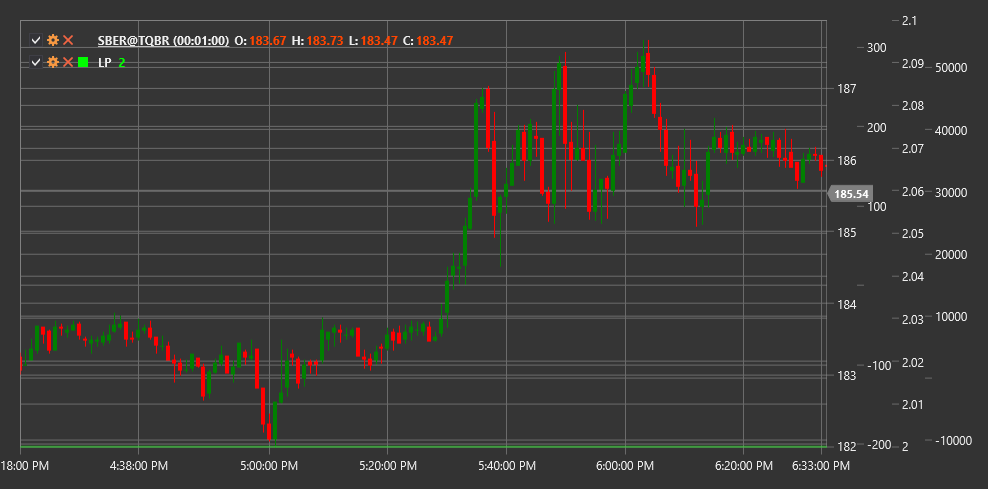

# LP

**Lunar Phase (LP)** is an unconventional technical indicator based on astronomical data about moon phases to analyze the potential influence of lunar cycles on financial markets.

To use the indicator, you need to use the [LunarPhase](xref:StockSharp.Algo.Indicators.LunarPhase) class.

## Description

The Lunar Phase (LP) indicator is an unusual technical analysis tool that uses information about the current moon phase to potentially forecast market trends. The indicator is based on the theory that lunar cycles may influence market participant behavior and, consequently, financial instrument price movements.

The lunar cycle lasts approximately 29.53 days and is traditionally divided into four main phases:
1. New Moon
2. First Quarter (Waxing Moon)
3. Full Moon
4. Last Quarter (Waning Moon)

The indicator tracks the current moon phase and represents this information as a numerical value from 0 to 1, where:
- 0 corresponds to the new moon
- 0.25 corresponds to the first quarter
- 0.5 corresponds to the full moon
- 0.75 corresponds to the last quarter

## Calculation

Lunar Phase indicator calculation is based on astronomical algorithms for determining the current moon phase:

1. Determine the number of days passed since the start of the lunar cycle (new moon):
   ```
   Current_Cycle_Position = (Current_Date - Last_New_Moon_Date) % 29.53
   ```

2. Convert this value to a phase from 0 to 1:
   ```
   Moon_Phase = Current_Cycle_Position / 29.53
   ```

The resulting value is the Lunar Phase (LP) indicator.

## Interpretation

Lunar Phase indicator interpretation can vary, as it is an unconventional technical analysis tool. However, there are some commonly accepted approaches:

1. **Potential Reversal Points**:
   - Some traders believe that new and full moons may coincide with market reversal points
   - Transitions between main phases can also be viewed as potential periods of increased volatility

2. **Market Sentiment Cycles**:
   - There is a theory that moon phases can influence mass psychology and, consequently, market sentiment
   - Some studies suggest that the full moon period may lead to more emotional and irrational trader behavior

3. **Volatility Correlation**:
   - Some studies show that volatility may be higher during full moon and new moon periods
   - This can be used when adjusting parameters of other indicators and strategies

4. **Seasonal Patterns**:
   - LP can be used in combination with seasonal pattern analysis to identify potential market periodicities

5. **Signal Filtering**:
   - Some traders use LP as an additional filter for their trading strategies
   - For example, they may avoid certain types of trades during specific lunar phases if historical statistics show low efficiency

6. **Combining with Other Indicators**:
   - LP is typically not used as a standalone tool for making trading decisions
   - It is recommended to combine it with traditional technical indicators to confirm signals

It is important to note that there is insufficient scientific evidence of direct lunar phase influence on financial markets, and many professional traders approach such tools skeptically. However, some market participants find value in including LP in their analytical arsenal.



## See Also

[SineWave](sine_wave.md)
[HarmonicOscillator](harmonic_oscillator.md)