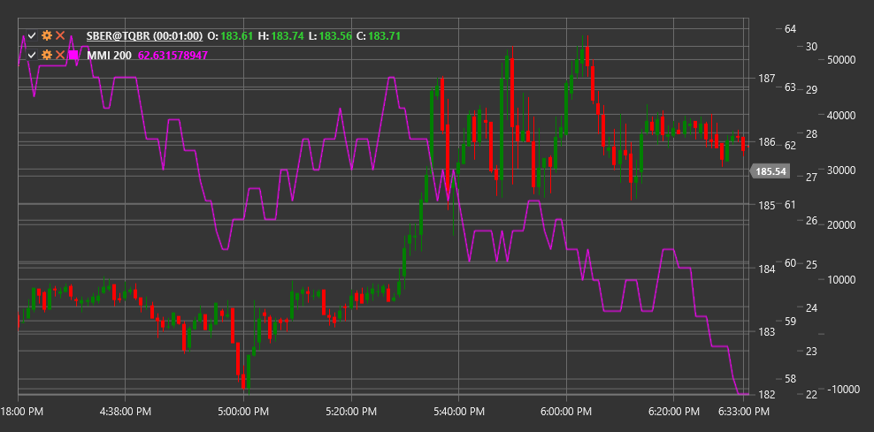

# MMI

**Market Meanness Index (MMI)** is a technical indicator developed to determine whether the market is in a trending or sideways (chaotic) state.

To use the indicator, you need to use the [MarketMeannessIndex](xref:StockSharp.Algo.Indicators.MarketMeannessIndex) class.

## Description

The Market Meanness Index (MMI) is a tool that helps traders determine the nature of the current market - whether it is trending or sideways. The name "Meanness" reflects the idea that the market sometimes behaves "meanly" or unpredictably towards traders, especially when in a sideways movement.

MMI is based on counting the number of price value pairs (usually closing prices) that do not follow a simple linear pattern, and their ratio to the total number of analyzed pairs. The indicator measures the "chaos" or "randomness" of price movement over a specific period.

The index oscillates from 0 to 100:
- Low values (usually below 50) indicate predominance of trending movement
- High values (usually above 50) indicate predominance of sideways or chaotic movement

## Parameters

The indicator has the following parameters:
- **Length** - calculation period (default value: 20)

## Calculation

Market Meanness Index calculation involves the following steps:

1. Create a set of consecutive closing price (Close) pairs within the given Length period.

2. Count the number of "non-sequential" pairs. A pair is considered non-sequential if it does not follow the linear pattern typical of a trend. If two consecutive pairs (P1, P2) and (P2, P3) have opposite directions (different difference signs), the pair is considered non-sequential.

3. Calculate MMI as a percentage ratio:
   ```
   MMI = (Number of non-sequential pairs / Total number of pairs) * 100
   ```

Formally, this can be represented as:
1. For each trio of consecutive prices (Close[i-2], Close[i-1], Close[i]), check:
   - If (Close[i-1] - Close[i-2]) * (Close[i] - Close[i-1]) < 0, the pair is considered non-sequential
   - Count the total number of such pairs

2. MMI = (Number of non-sequential pairs / (Length - 2)) * 100

## Interpretation

The Market Meanness Index can be interpreted as follows:

1. **Indicator Levels**:
   - MMI > 50: Market is in a sideways or chaotic state
   - MMI < 50: Market is in a trending state
   - The closer MMI is to 100, the more chaotic the market
   - The closer MMI is to 0, the more pronounced the trend

2. **Trading Strategy Application**:
   - When MMI is high (>50), use strategies oriented towards sideways market (e.g., range trading, oscillators)
   - When MMI is low (<50), use trend strategies (e.g., trend following)

3. **Dynamics of Changes**:
   - Decrease in MMI from high levels may signal the formation of a new trend
   - Increase in MMI from low levels may indicate trend completion and transition to consolidation

4. **Extreme Values**:
   - Very low values (MMI < 20) may indicate a strong trend, but also potential overbought/oversold conditions
   - Very high values (MMI > 80) indicate an extremely chaotic market where it's difficult to apply any strategies

5. **Signal Filtering**:
   - MMI is often used as a filter for other indicators:
     - Trend indicator signals (MA, MACD) are more reliable at low MMI
     - Oscillator signals (RSI, Stochastic) are more reliable at high MMI

6. **Combining with Other Indicators**:
   - MMI works well in combination with ADX (Average Directional Index)
   - Low MMI and high ADX confirm a strong trend
   - High MMI and low ADX confirm a sideways market

7. **Timeframes**:
   - MMI can be used on different timeframes to determine market character
   - Long-term MMI helps determine the market's primary state
   - Short-term MMI helps choose an appropriate strategy for current conditions



## See Also

[ChoppinessIndex](choppiness_index.md)
[ADX](adx.md)
[VHF](vhf.md)
[BalanceOfPower](balance_of_power.md)