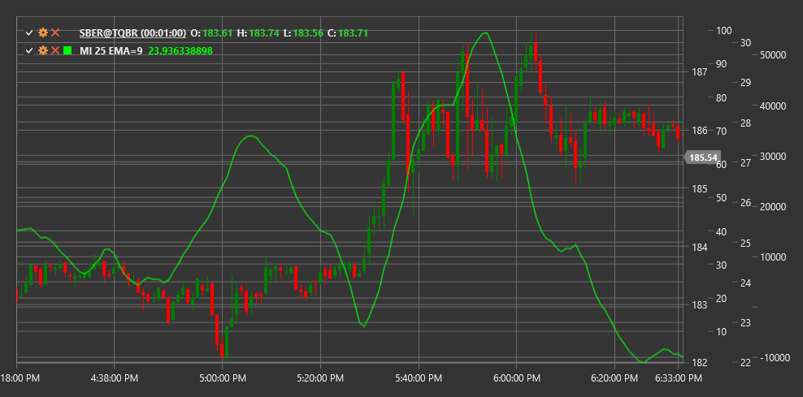

# MI

**Mass Index (MI)** is a technical indicator developed by Donald Dorsey that identifies potential trend reversals by analyzing price range expansion and contraction.

To use the indicator, you need to use the [MassIndex](xref:StockSharp.Algo.Indicators.MassIndex) class.

## Description

The Mass Index (MI) is a technical analysis tool that helps detect potential trend reversals by tracking changes in the price range (difference between maximum and minimum prices). The indicator was developed by Donald Dorsey based on the assumption that trend reversals are typically preceded by expansion and subsequent contraction of the price range.

MI measures volatility using exponential moving averages (EMA) of the price range. It does not predict the reversal direction, only its probability. This is why MI is often used in conjunction with other directional indicators.

The main concept is that when the mass index reaches a certain threshold and then falls below this level, the likelihood of a current trend reversal increases.

## Parameters

The indicator has the following parameters:
- **Length** - main calculation period (default value: 25)
- **EmaLength** - period for price range EMA (default value: 9)

## Calculation

Mass Index calculation involves the following steps:

1. Calculate High-Low range for each period:
   ```
   Range = High - Low
   ```

2. Calculate 9-period EMA of the range:
   ```
   EMA1 = EMA(Range, EmaLength)
   ```

3. Calculate 9-period EMA of the range's EMA:
   ```
   EMA2 = EMA(EMA1, EmaLength)
   ```

4. Calculate the ratio:
   ```
   Ratio = EMA1 / EMA2
   ```

5. Sum ratios over 25 periods:
   ```
   MI = Sum(Ratio over last Length periods)
   ```

Where:
- High - period's highest price
- Low - period's lowest price
- EMA - exponential moving average
- Length - summation period (usually 25)
- EmaLength - EMA period (usually 9)

## Interpretation

The Mass Index is interpreted as follows:

1. **"Reversal Hump"**:
   - The classic "reversal hump" signal forms when the mass index rises above 27 and then falls below 26.5
   - This pattern indicates a possible trend reversal, though it does not predict its direction

2. **Index Levels**:
   - Values above 27 indicate price range expansion and increased volatility
   - High values followed by a decline may precede a trend reversal
   - Low values (below 20) indicate price range contraction and reduced volatility

3. **Trend Direction**:
   - The mass index does not indicate trend direction or its reversal
   - Additional indicators or analysis methods are needed to determine direction (e.g., moving averages or support/resistance levels)

4. **Divergences**:
   - Divergences between price and mass index are less significant than the "reversal hump" pattern
   - However, discrepancies between price's new highs/lows and declining mass index highs/lows may indicate trend weakening

5. **Combining with Other Indicators**:
   - Mass index works best when combined with trend direction indicators
   - Popular combinations include EMA, MACD, or RSI to determine potential reversal direction

6. **Volatility Changes**:
   - Sharp mass index increase indicates significant price range expansion, which may precede a strong movement
   - Gradual index decline suggests range narrowing and possible consolidation

7. **Parameter Tuning**:
   - Standard parameters (9 for EMA, 25 for summation) work well on most timeframes
   - Reducing periods can create faster signals but may increase false signals



## See Also

[ATR](atr.md)
[BollingerBands](bollinger_bands.md)
[ChoppinessIndex](choppiness_index.md)
[TrueRange](true_range.md)