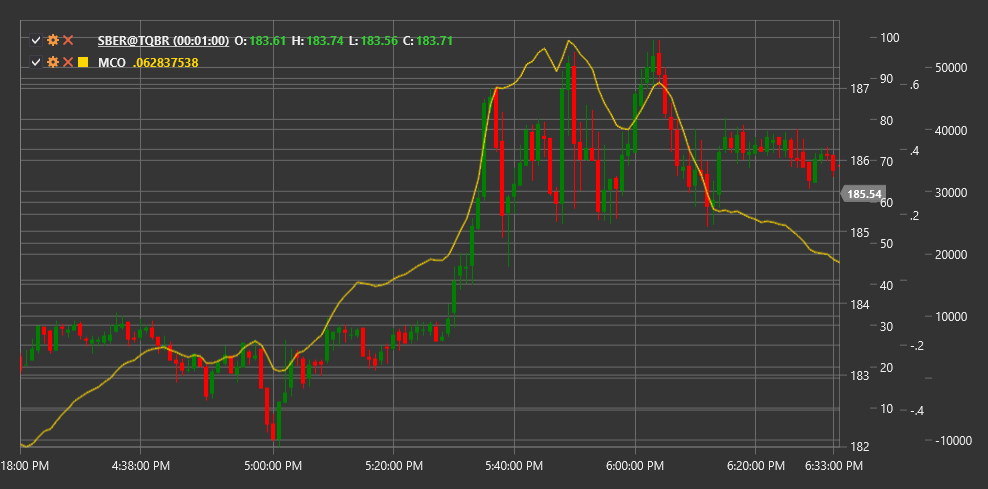

# MCO

**McClellan Oscillator (MCO)** is a technical indicator developed by Sherman and Marian McClellan that measures market breadth by analyzing the difference between moving averages of advancing and declining stocks.

To use the indicator, you need to use the [McClellanOscillator](xref:StockSharp.Algo.Indicators.McClellanOscillator) class.

## Description

The McClellan Oscillator (MCO) is one of the most well-known market breadth indicators that helps assess the overall market condition and identify potential reversal points. Developed in 1969, it has since become a crucial tool for many technical analysts.

MCO is based on analyzing the ratio between the number of rising and falling stocks in the market. The indicator calculates the difference between 19-period and 39-period exponential moving averages of net advances (difference between the number of advancing and declining stocks).

The McClellan Oscillator is particularly useful for:
- Determining the overall market direction
- Identifying overbought and oversold conditions
- Identifying potential reversal points
- Confirming the strength or weakness of the current trend

## Calculation

McClellan Oscillator calculation involves the following steps:

1. Calculate Net Advances for each trading day:
   ```
   Net Advances = Advances - Declines
   ```
   where Advances is the number of rising stocks, Declines is the number of falling stocks.

2. Calculate 19-period exponential moving average of Net Advances:
   ```
   EMA19 = EMA(Net Advances, 19)
   ```

3. Calculate 39-period exponential moving average of Net Advances:
   ```
   EMA39 = EMA(Net Advances, 39)
   ```

4. Compute McClellan Oscillator as the difference between these two EMAs:
   ```
   MCO = EMA19 - EMA39
   ```

## Interpretation

The McClellan Oscillator can be interpreted as follows:

1. **Zero Line Crossovers**:
   - MCO crossing the zero line from bottom to top can be viewed as a bullish signal, indicating a potential upward trend start
   - MCO crossing the zero line from top to bottom can be viewed as a bearish signal, indicating a potential downward trend start

2. **Extreme Values**:
   - Values above +100 often indicate market overbought conditions
   - Values below -100 often indicate market oversold conditions
   - Extreme values (+150/-150 and above/below) may signal a potential market reversal

3. **Divergences**:
   - Bullish Divergence: index forms a new low, while MCO forms a higher low
   - Bearish Divergence: index forms a new high, while MCO forms a lower high

4. **Market Breadth State**:
   - Positive MCO values indicate that most stocks in the market are rising
   - Negative MCO values indicate that most stocks in the market are falling

5. **Movement Acceleration/Deceleration**:
   - Increasing MCO values (positive or negative) indicate acceleration of the current market movement
   - Decreasing MCO values indicate deceleration of the current market movement

6. **Combining with McClellan Summation Index**:
   - McClellan Summation Index (MSI) is the cumulative sum of MCO values
   - MSI crossing zero can confirm MCO signals and indicate long-term trend changes

7. **Bullish/Bearish Patterns**:
   - "Bullish Tail" - rapid MCO decline followed by quick recovery, often indicating a potential market bottom
   - "Bearish Tail" - rapid MCO rise followed by quick decline, often indicating a potential market top



## See Also

[HighLowIndex](high_low_index.md)