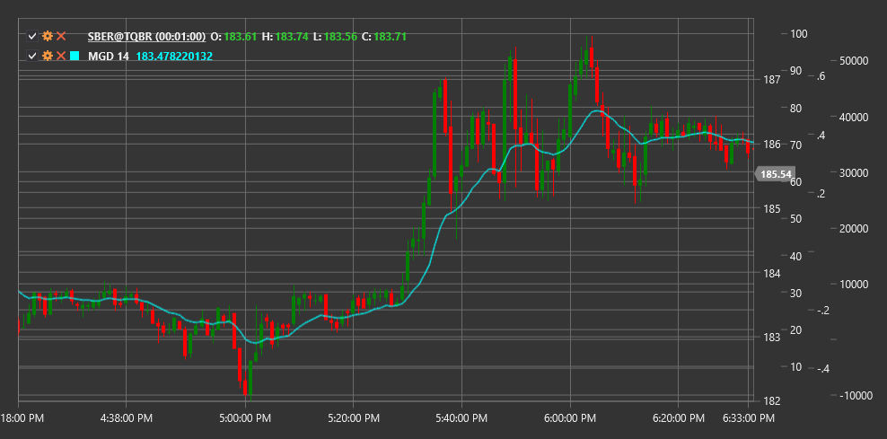

# MGD

**McGinley Dynamic (MGD)** is a technical indicator developed by John R. McGinley that represents an advanced form of moving average, automatically adjusting its speed based on market velocity changes.

To use the indicator, you need to use the [McGinleyDynamic](xref:StockSharp.Algo.Indicators.McGinleyDynamic) class.

## Description

McGinley Dynamic (MGD) was created by John McGinley to overcome some drawbacks of traditional moving averages, such as lagging and inability to adapt to market speed changes. The indicator automatically adjusts its reaction period depending on price movement speed, making it more sensitive to rapid changes and less prone to false signals.

Unlike simple and exponential moving averages, MGD incorporates a tuning constant and the ratio of price to the previous indicator value. This allows MGD to respond more quickly to significant price changes while maintaining stability during slower movements.

The main idea is that MGD "accelerates" during rapid market movements and "slows down" during consolidation periods, providing more accurate price tracking compared to traditional moving averages.

## Parameters

The indicator has the following parameters:
- **Length** - calculation period (default value: 14)

## Calculation

McGinley Dynamic calculation is performed recursively using the following formula:

```
MGD = MGD[previous] + (Price - MGD[previous]) / (Length * ((Price / MGD[previous])^4))
```

Where:
- Price - current price (usually closing price)
- MGD[previous] - previous indicator value
- Length - period parameter

For the initial MGD value, a simple moving average over the specified period is typically used:

```
For first calculation: MGD = SMA(Price, Length)
```

## Interpretation

McGinley Dynamic can be interpreted similarly to other moving averages, but with its improved characteristics:

1. **Trend Determination**:
   - When price is above MGD, it indicates an upward trend
   - When price is below MGD, it indicates a downward trend
   - A steep MGD slope indicates a strong trend

2. **Price Crossovers**:
   - Price crossing MGD from bottom to top can be viewed as a bullish signal
   - Price crossing MGD from top to bottom can be viewed as a bearish signal
   - Due to its adaptive nature, these crossovers typically form earlier than with traditional moving averages

3. **Multiple MGD Crossovers**:
   - Multiple MGDs with different periods can be used (e.g., MGD(14) and MGD(30))
   - Short MGD crossing long MGD from bottom to top can be viewed as bullish trend confirmation
   - Short MGD crossing long MGD from top to bottom can be viewed as bearish trend confirmation

4. **Support and Resistance Levels**:
   - MGD often serves as a dynamic support level in an upward trend
   - MGD often serves as a dynamic resistance level in a downward trend
   - Multiple bounces off MGD confirm trend strength

5. **Price Relationship**:
   - Distance between price and MGD can indicate market overbought or oversold conditions
   - When price significantly deviates from MGD, it may signal a potential reversal or correction

6. **Combining with Other Indicators**:
   - MGD works well with oscillators (RSI, Stochastic)
   - Can be used as a trend filter for other trading systems

7. **Length Parameter Selection**:
   - Smaller Length values (e.g., 8-12) make MGD more sensitive to price changes and suit short-term trading
   - Larger Length values (e.g., 20-50) make MGD smoother and suit long-term trading



## See Also

[SMA](sma.md)
[EMA](ema.md)
[DEMA](dema.md)
[HMA](hma.md)